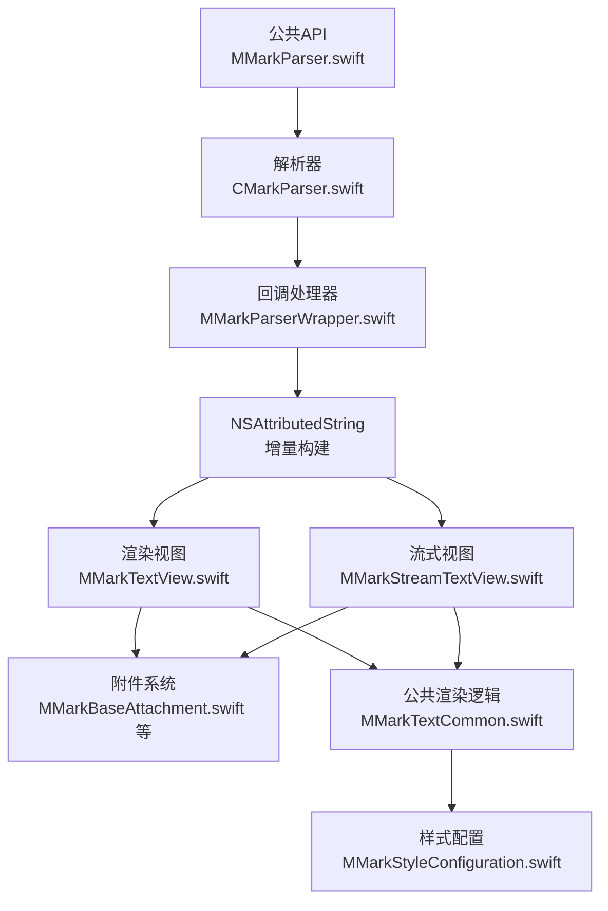
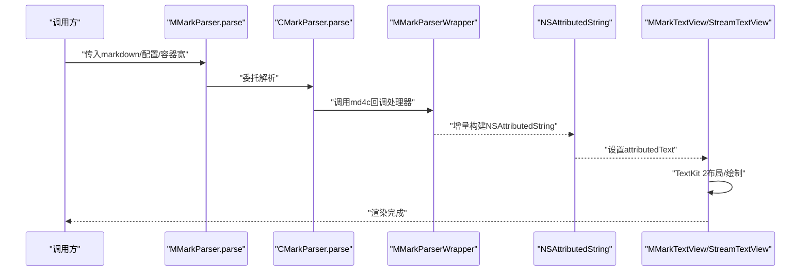
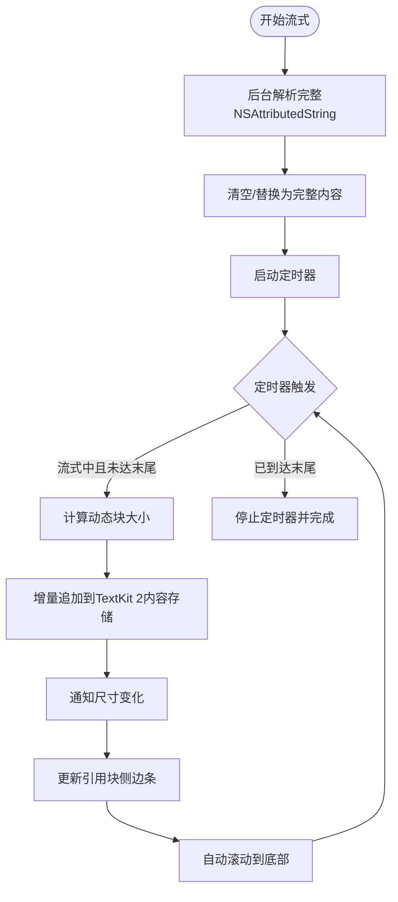
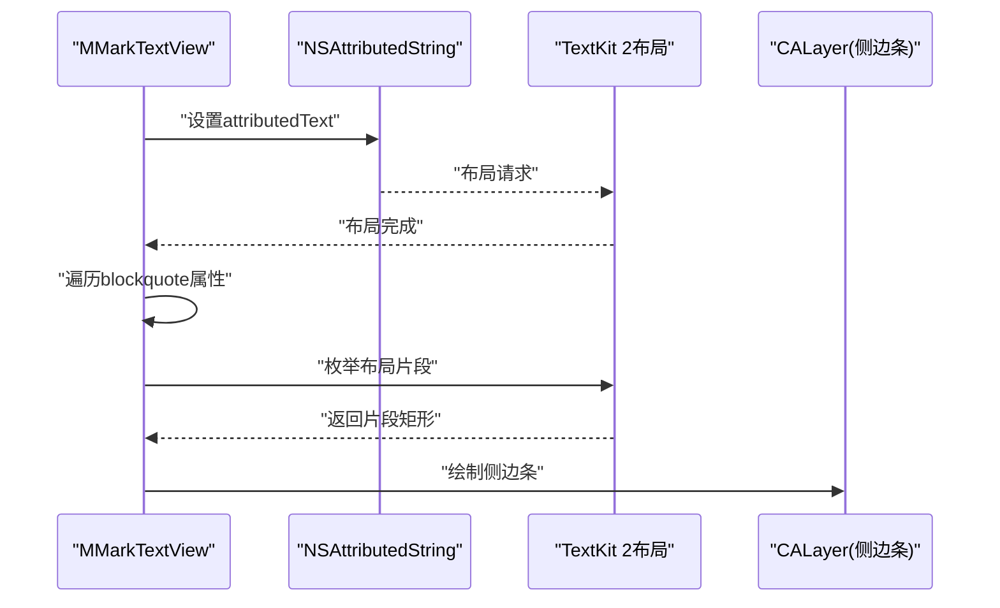
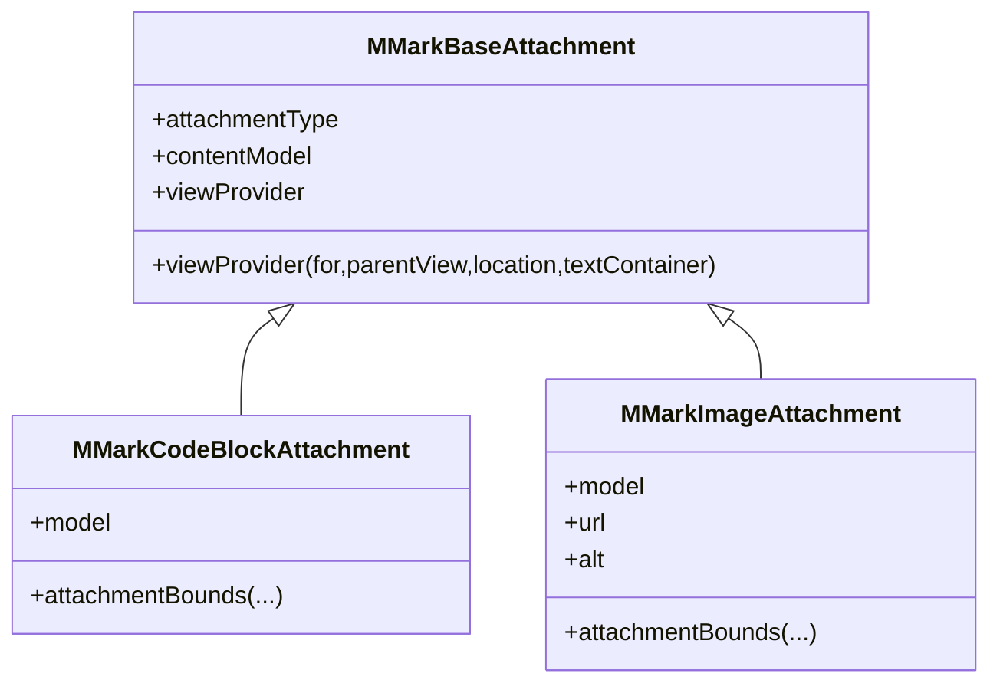
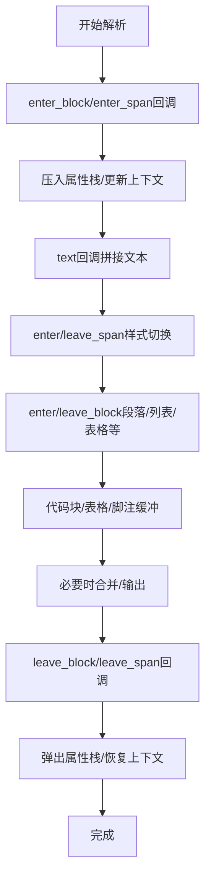
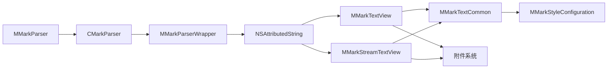

# 性能优化策略

<cite>
**本文档引用的文件**
- [MMarkParser.swift](file://MMarkParser/Sources/MMarkParser.swift)
- [CMarkParser.swift](file://MMarkParser/Sources/Parser/CMarkParser.swift)
- [MMarkParserWrapper.swift](file://MMarkParser/Sources/Parser/MMarkParserWrapper.swift)
- [MMarkTextView.swift](file://MMarkParser/Sources/Renderer/MMarkTextView.swift)
- [MMarkStreamTextView.swift](file://MMarkParser/Sources/Renderer/MMarkStreamTextView.swift)
- [MMarkTextCommon.swift](file://MMarkParser/Sources/Renderer/MMarkTextCommon.swift)
- [MMarkStyleConfiguration.swift](file://MMarkParser/Sources/Renderer/MMarkStyleConfiguration.swift)
- [MMarkBaseAttachment.swift](file://MMarkParser/Sources/Renderer/Attachments/MMarkBaseAttachment/MMarkBaseAttachment.swift)
- [MMarkCodeBlockAttachment.swift](file://MMarkParser/Sources/Renderer/Attachments/MMarkCodeBlockAttachment/MMarkCodeBlockAttachment.swift)
- [MMarkImageAttachment.swift](file://MMarkParser/Sources/Renderer/Attachments/MMarkImageAttachment/MMarkImageAttachment.swift)
- [README.md](file://README.md)
- [StreamViewController.swift](file://cocoapod_demo/cocoapod_demo/StreamViewController.swift)
- [ViewController.swift](file://cocoapod_demo/cocoapod_demo/ViewController.swift)
</cite>

## 目录
1. [简介](#简介)
2. [项目结构](#项目结构)
3. [核心组件](#核心组件)
4. [架构总览](#架构总览)
5. [详细组件分析](#详细组件分析)
6. [依赖关系分析](#依赖关系分析)
7. [性能考量](#性能考量)
8. [故障排查指南](#故障排查指南)
9. [结论](#结论)
10. [附录](#附录)

## 简介
本文件面向MMarkParser的性能优化，聚焦于TextKit 2在iOS 15+上的性能优势与实现细节，涵盖增量布局、懒加载与内存管理策略；针对大文档的流式渲染、分页加载与虚拟化思路；解析器端的缓存、并行处理与内存复用；以及渲染性能的监控与调试方法，并给出可操作的最佳实践与测试建议。

## 项目结构
- 公共API入口：MMarkParser.swift 提供parse/markdown扩展，统一对外接口。
- 解析层：CMarkParser.swift封装md4c选项与回调处理器，负责将Markdown增量构建为NSAttributedString。
- 渲染层：MMarkTextView.swift与MMarkStreamTextView.swift分别提供一次性渲染与流式渲染；MMarkTextCommon.swift提供公共渲染逻辑（如引用块侧边条绘制）。
- 附件系统：基于NSTextAttachment与ViewProvider的懒加载机制，复杂元素（代码块、表格、图片、数学公式、水平分割线、列表标记）按需创建视图。
- 样式配置：MMarkStyleConfiguration.swift集中管理字体、颜色、间距等样式，影响布局与绘制成本。
- 示例与演示：cocoapod_demo中的StreamViewController与ViewController展示流式渲染与基础渲染的使用方式。

图表来源
- [MMarkParser.swift:18-26](file://MMarkParser/Sources/MMarkParser.swift#L18-L26)
- [CMarkParser.swift:56-66](file://MMarkParser/Sources/Parser/CMarkParser.swift#L56-L66)
- [MMarkParserWrapper.swift:16-18](file://MMarkParser/Sources/Parser/MMarkParserWrapper.swift#L16-L18)
- [MMarkTextView.swift:40-49](file://MMarkParser/Sources/Renderer/MMarkTextView.swift#L40-L49)
- [MMarkStreamTextView.swift:174-201](file://MMarkParser/Sources/Renderer/MMarkStreamTextView.swift#L174-L201)
- [MMarkTextCommon.swift:132-249](file://MMarkParser/Sources/Renderer/MMarkTextCommon.swift#L132-L249)
- [MMarkStyleConfiguration.swift:189-267](file://MMarkParser/Sources/Renderer/MMarkStyleConfiguration.swift#L189-L267)

章节来源
- [README.md:108-212](file://README.md#L108-L212)

## 核心组件
- 公共API与便捷扩展：提供parse与String.parseMarkdown，统一入口，便于集成与测试。
- 解析器与回调处理器：基于md4c SAX回调模型，增量构建NSAttributedString，减少中间结构与重复扫描。
- 文本视图与流式视图：MMarkTextView用于一次性渲染；MMarkStreamTextView通过定时器驱动的增量插入与TextKit 2编辑事务，实现“打字机”式流式渲染。
- 附件与懒加载：MMarkBaseAttachment根据类型选择对应ViewProvider，复杂元素按需创建，降低初始内存占用。
- 公共渲染逻辑：引用块侧边条绘制、锚点与脚注跳转、行高估算与范围合并，均在主线程安全路径中执行，避免频繁布局刷新。

章节来源
- [MMarkParser.swift:18-41](file://MMarkParser/Sources/MMarkParser.swift#L18-L41)
- [CMarkParser.swift:56-66](file://MMarkParser/Sources/Parser/CMarkParser.swift#L56-L66)
- [MMarkTextView.swift:40-81](file://MMarkParser/Sources/Renderer/MMarkTextView.swift#L40-L81)
- [MMarkStreamTextView.swift:21-398](file://MMarkParser/Sources/Renderer/MMarkStreamTextView.swift#L21-L398)
- [MMarkBaseAttachment.swift:32-58](file://MMarkParser/Sources/Renderer/Attachments/MMarkBaseAttachment/MMarkBaseAttachment.swift#L32-L58)
- [MMarkTextCommon.swift:132-249](file://MMarkParser/Sources/Renderer/MMarkTextCommon.swift#L132-L249)

## 架构总览
整体数据流自上而下：字符串输入经解析器增量生成NSAttributedString，随后交由TextKit 2进行布局与显示；附件通过ViewProvider懒加载，避免一次性创建大量视图对象。

图表来源
- [MMarkParser.swift:18-26](file://MMarkParser/Sources/MMarkParser.swift#L18-L26)
- [CMarkParser.swift:56-66](file://MMarkParser/Sources/Parser/CMarkParser.swift#L56-L66)
- [MMarkParserWrapper.swift:16-18](file://MMarkParser/Sources/Parser/MMarkParserWrapper.swift#L16-L18)
- [MMarkTextView.swift:40-49](file://MMarkParser/Sources/Renderer/MMarkTextView.swift#L40-L49)

## 详细组件分析

### 组件A：流式渲染（MMarkStreamTextView）与增量布局
- 增量插入策略：通过定时器周期性地将已解析的NSAttributedString增量追加至TextKit 2内容存储，避免全量重排。
- 并行解析：解析在独立队列执行，主线程仅负责UI更新与尺寸通知，降低主线程阻塞风险。
- 动态块大小：对超长文档自动增大chunk大小，维持流畅的视觉进度。
- TextKit 2路径：优先使用textContentManager.performEditingTransaction进行批量编辑，回退到TextKit 1时使用beginEditing/endEditing保证一致性。
- 自动滚动与尺寸通知：基于sizeThatFits估算高度，避免强制触发TextKit 1桥接路径，减少布局抖动。

图表来源
- [MMarkStreamTextView.swift:174-201](file://MMarkParser/Sources/Renderer/MMarkStreamTextView.swift#L174-L201)
- [MMarkStreamTextView.swift:304-351](file://MMarkParser/Sources/Renderer/MMarkStreamTextView.swift#L304-L351)
- [MMarkStreamTextView.swift:113-139](file://MMarkParser/Sources/Renderer/MMarkStreamTextView.swift#L113-L139)
- [MMarkStreamTextView.swift:142-156](file://MMarkParser/Sources/Renderer/MMarkStreamTextView.swift#L142-L156)
- [MMarkStreamTextView.swift:365-379](file://MMarkParser/Sources/Renderer/MMarkStreamTextView.swift#L365-L379)

章节来源
- [MMarkStreamTextView.swift:21-398](file://MMarkParser/Sources/Renderer/MMarkStreamTextView.swift#L21-L398)

### 组件B：一次性渲染（MMarkTextView）与引用块侧边条
- 一次性渲染：解析完成后直接设置attributedText，适合中短文档或已知长度的场景。
- 引用块侧边条：基于TextKit 2的enumerateTextLayoutFragments遍历布局片段，计算每层blockquote的包围矩形，绘制CALayer作为侧边条；在iOS 16+路径中更高效。
- 链接处理：统一处理脚注与锚点跳转，避免系统默认行为导致的异常。

图表来源
- [MMarkTextView.swift:40-61](file://MMarkParser/Sources/Renderer/MMarkTextView.swift#L40-L61)
- [MMarkTextCommon.swift:132-249](file://MMarkParser/Sources/Renderer/MMarkTextCommon.swift#L132-L249)

章节来源
- [MMarkTextView.swift:40-81](file://MMarkParser/Sources/Renderer/MMarkTextView.swift#L40-L81)
- [MMarkTextCommon.swift:132-249](file://MMarkParser/Sources/Renderer/MMarkTextCommon.swift#L132-L249)

### 组件C：附件懒加载与内存管理
- 类型分派：MMarkBaseAttachment根据attachmentType选择对应ViewProvider，避免在初始化阶段创建视图。
- 视图延迟创建：NSTextAttachmentViewProvider按需实例化，结合TextKit 2的contentManager事务，减少一次性分配。
- 附件尺寸约束：各附件在attachmentBounds中根据lineFrag与模型尺寸计算最终bounds，避免溢出与裁剪。

图表来源
- [MMarkBaseAttachment.swift:12-58](file://MMarkParser/Sources/Renderer/Attachments/MMarkBaseAttachment/MMarkBaseAttachment.swift#L12-L58)
- [MMarkCodeBlockAttachment.swift:6-21](file://MMarkParser/Sources/Renderer/Attachments/MMarkCodeBlockAttachment/MMarkCodeBlockAttachment.swift#L6-L21)
- [MMarkImageAttachment.swift:5-22](file://MMarkParser/Sources/Renderer/Attachments/MMarkImageAttachment/MMarkImageAttachment.swift#L5-L22)

章节来源
- [MMarkBaseAttachment.swift:12-58](file://MMarkParser/Sources/Renderer/Attachments/MMarkBaseAttachment/MMarkBaseAttachment.swift#L12-L58)
- [MMarkCodeBlockAttachment.swift:6-21](file://MMarkParser/Sources/Renderer/Attachments/MMarkCodeBlockAttachment/MMarkCodeBlockAttachment.swift#L6-L21)
- [MMarkImageAttachment.swift:5-22](file://MMarkParser/Sources/Renderer/Attachments/MMarkImageAttachment/MMarkImageAttachment.swift#L5-L22)

### 组件D：解析器与回调处理器（增量构建）
- md4c SAX回调：在回调中维护属性栈与上下文状态，增量拼接NSAttributedString，避免AST转换带来的额外开销。
- 上下文控制：块/内联状态、列表计数、脚注缓冲、表格累积等，确保嵌套结构正确继承样式。
- 错误处理：解析失败时返回空NSAttributedString或抛出ParseError，便于上层降级处理。

图表来源
- [MMarkParserWrapper.swift:134-644](file://MMarkParser/Sources/Parser/MMarkParserWrapper.swift#L134-L644)

章节来源
- [CMarkParser.swift:56-66](file://MMarkParser/Sources/Parser/CMarkParser.swift#L56-L66)
- [MMarkParserWrapper.swift:16-18](file://MMarkParser/Sources/Parser/MMarkParserWrapper.swift#L16-L18)

## 依赖关系分析
- 公共API依赖解析器；解析器依赖md4c回调处理器；渲染视图依赖TextKit 2与附件系统；公共逻辑依赖样式配置。
- 附件系统通过NSTextAttachment注册ViewProvider，形成“类型→提供者”的映射，解耦渲染与附件实现。
- 流式视图与一次性视图共享公共渲染逻辑，降低重复实现与维护成本。

图表来源
- [MMarkParser.swift:18-26](file://MMarkParser/Sources/MMarkParser.swift#L18-L26)
- [CMarkParser.swift:56-66](file://MMarkParser/Sources/Parser/CMarkParser.swift#L56-L66)
- [MMarkTextView.swift:40-49](file://MMarkParser/Sources/Renderer/MMarkTextView.swift#L40-L49)
- [MMarkStreamTextView.swift:174-201](file://MMarkParser/Sources/Renderer/MMarkStreamTextView.swift#L174-L201)
- [MMarkTextCommon.swift:44-46](file://MMarkParser/Sources/Renderer/MMarkTextCommon.swift#L44-L46)
- [MMarkStyleConfiguration.swift:189-267](file://MMarkParser/Sources/Renderer/MMarkStyleConfiguration.swift#L189-L267)
- [MMarkBaseAttachment.swift:40-50](file://MMarkParser/Sources/Renderer/Attachments/MMarkBaseAttachment/MMarkBaseAttachment.swift#L40-L50)

章节来源
- [README.md:108-212](file://README.md#L108-L212)

## 性能考量

### TextKit 2的性能优势与优化实现
- 增量布局：流式视图通过定时器与增量插入，避免全量重布局；TextKit 2的performEditingTransaction支持批量编辑，减少layout pass次数。
- 懒加载：附件ViewProvider按需创建，避免一次性创建大量视图对象，降低峰值内存与首帧延迟。
- 尺寸估算：通过sizeThatFits估算高度，避免强制触发TextKit 1桥接路径，减少不必要的布局计算。
- 引用块侧边条：在iOS 16+路径中使用enumerateTextLayoutFragments，按blockquote属性范围枚举布局片段，精准绘制侧边条，避免子视图管理带来的额外开销。

章节来源
- [MMarkStreamTextView.swift:113-156](file://MMarkParser/Sources/Renderer/MMarkStreamTextView.swift#L113-L156)
- [MMarkStreamTextView.swift:365-379](file://MMarkParser/Sources/Renderer/MMarkStreamTextView.swift#L365-L379)
- [MMarkTextCommon.swift:132-249](file://MMarkParser/Sources/Renderer/MMarkTextCommon.swift#L132-L249)

### 大文档处理的优化方案
- 流式渲染：通过定时器与动态块大小，维持稳定的帧率与视觉进度，适合超长文档的渐进展示。
- 分页加载：可借鉴流式渲染的思路，将文档切分为多个片段，按需解析与插入，避免一次性加载造成内存压力。
- 虚拟化技术：利用TextKit 2的布局片段枚举与范围定位，仅对可见区域进行精确布局与绘制，隐藏不可见区域的附件视图，降低CPU与GPU负载。

章节来源
- [MMarkStreamTextView.swift:340-349](file://MMarkParser/Sources/Renderer/MMarkStreamTextView.swift#L340-L349)
- [MMarkTextCommon.swift:170-211](file://MMarkParser/Sources/Renderer/MMarkTextCommon.swift#L170-L211)

### 解析器的性能优化
- 缓存机制：可在应用层缓存解析结果（键为markdown哈希+配置哈希），避免重复解析；当前仓库未内置缓存，建议在业务层实现LRU或TTL缓存。
- 并行处理：解析在独立队列执行，主线程仅负责UI更新，降低主线程阻塞；可进一步拆分大文档为多个片段并行解析，最后合并。
- 内存复用：回调处理器中使用NSMutableAttributedString与缓冲区（如代码块/表格/脚注），减少中间对象创建；注意及时释放不再使用的缓冲。

章节来源
- [CMarkParser.swift:56-66](file://MMarkParser/Sources/Parser/CMarkParser.swift#L56-L66)
- [MMarkParserWrapper.swift:22-130](file://MMarkParser/Sources/Parser/MMarkParserWrapper.swift#L22-L130)

### 渲染性能的监控与调试
- 布局时间测量：可通过在sizeThatFits前后记录时间戳，统计渲染耗时；流式视图已通过定时器tick与notifySizeChanged间接反映渲染节奏。
- 内存使用分析：使用Instruments的Allocations与Leaks工具观察NSAttributedString与附件视图的生命周期；关注TextKit 2内容存储与附件视图的峰值占用。
- UI线程阻塞检测：使用Thread Sanitizer与Time Profiler定位主线程卡顿；确保所有UI更新在主线程异步执行。

章节来源
- [MMarkStreamTextView.swift:365-379](file://MMarkParser/Sources/Renderer/MMarkStreamTextView.swift#L365-L379)
- [MMarkTextCommon.swift:9-16](file://MMarkParser/Sources/Renderer/MMarkTextCommon.swift#L9-L16)

### 最佳实践
- 配置参数优化：合理设置typingSpeed与chunkSize，平衡首屏速度与流畅度；对超长文档适当增大chunkSize。
- 资源管理：启用懒加载与按需创建，避免一次性创建大量附件视图；在不需要时及时释放不再使用的NSAttributedString。
- 用户体验平衡：自动滚动与尺寸通知应谨慎使用，避免频繁滚动打断用户阅读；对引用块侧边条绘制进行节流，避免高频重绘。

章节来源
- [MMarkStreamTextView.swift:34-41](file://MMarkParser/Sources/Renderer/MMarkStreamTextView.swift#L34-L41)
- [MMarkStreamTextView.swift:365-379](file://MMarkParser/Sources/Renderer/MMarkStreamTextView.swift#L365-L379)
- [MMarkTextCommon.swift:132-249](file://MMarkParser/Sources/Renderer/MMarkTextCommon.swift#L132-L249)

### 性能测试方法与基准测试
- 基准测试：准备不同长度与复杂度的Markdown样本（含表格、图片、数学公式、多级引用块），测量解析耗时、首帧时间、内存峰值与滚动帧率。
- 回归测试：在不同设备与iOS版本上验证性能表现，重点关注iOS 16+与16以下的差异（TextKit 2路径与回退路径）。
- A/B对比：对比一次性渲染与流式渲染在不同chunkSize下的帧率与内存占用，选择最优策略。

章节来源
- [StreamViewController.swift:208-245](file://cocoapod_demo/cocoapod_demo/StreamViewController.swift#L208-L245)
- [ViewController.swift:38-43](file://cocoapod_demo/cocoapod_demo/ViewController.swift#L38-L43)

## 故障排查指南
- 解析失败降级：当解析失败时返回空NSAttributedString或使用原始字符串，避免崩溃；可在上层记录日志并提示用户。
- 链接与锚点：统一处理脚注与锚点跳转，避免系统默认行为导致的异常；对URL进行百分比编码，防止特殊字符引发桥接层问题。
- 引用块侧边条闪烁：避免重复绘制同一层，先清理旧层再绘制新层；在iOS 16+路径中确保仅在布局完成后绘制。

章节来源
- [CMarkParser.swift:8-12](file://MMarkParser/Sources/Parser/CMarkParser.swift#L8-L12)
- [MMarkParserWrapper.swift:690-701](file://MMarkParser/Sources/Parser/MMarkParserWrapper.swift#L690-L701)
- [MMarkTextCommon.swift:138-139](file://MMarkParser/Sources/Renderer/MMarkTextCommon.swift#L138-L139)

## 结论
MMarkParser通过md4c SAX回调与TextKit 2的组合，实现了高效的增量渲染与懒加载机制。流式视图在大文档场景下提供了良好的用户体验，配合动态块大小与批量编辑事务，有效降低了主线程压力与内存峰值。建议在业务层引入解析结果缓存与分片并行解析，并结合Instruments进行持续性能监控，以获得最佳的综合性能表现。

## 附录
- 示例控制器展示了流式渲染的典型用法与参数调节，可作为性能调优的参考入口。
- 默认样式配置集中于MMarkStyleConfiguration，可根据产品需求调整字体、颜色与间距，以平衡渲染质量与性能。

章节来源
- [StreamViewController.swift:167-199](file://cocoapod_demo/cocoapod_demo/StreamViewController.swift#L167-L199)
- [MMarkStyleConfiguration.swift:189-267](file://MMarkParser/Sources/Renderer/MMarkStyleConfiguration.swift#L189-L267)