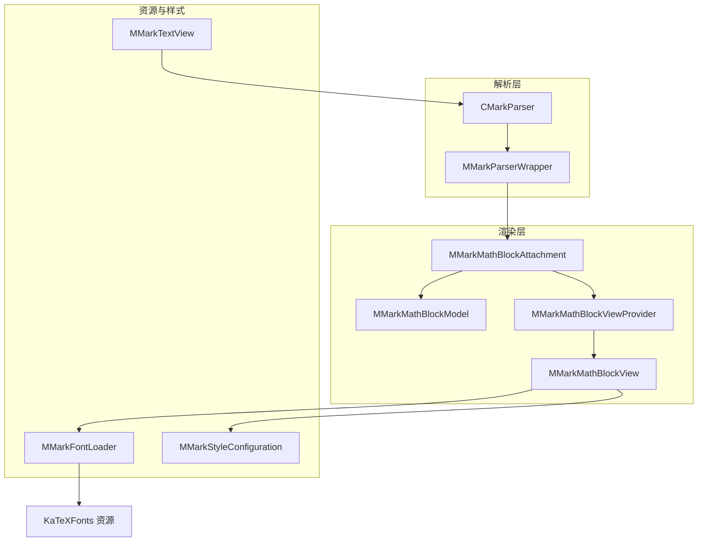
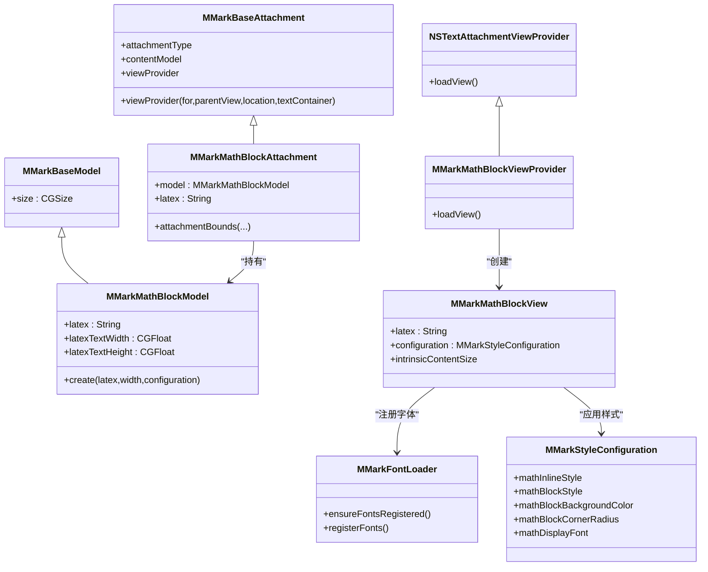
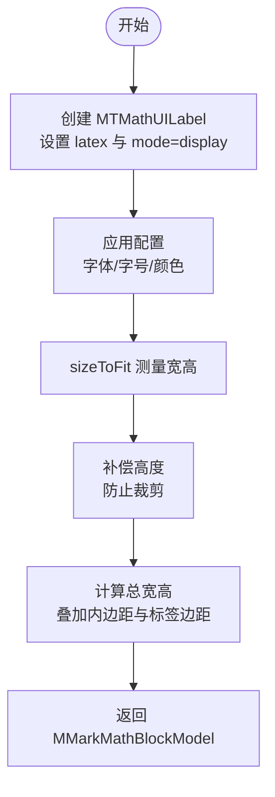
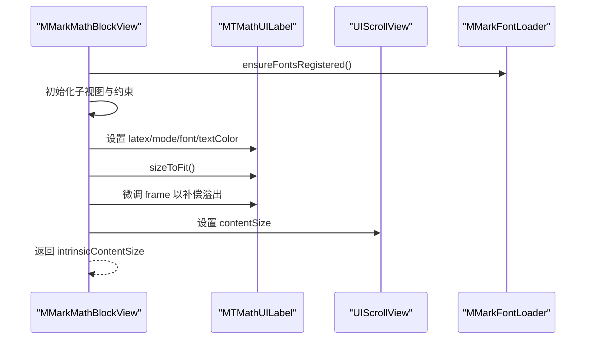
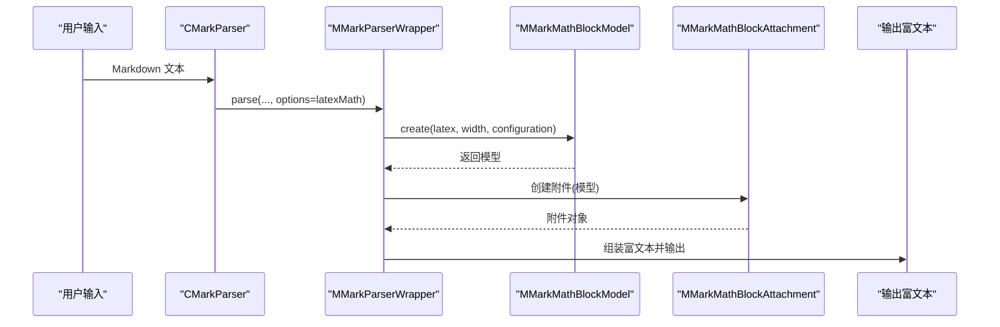
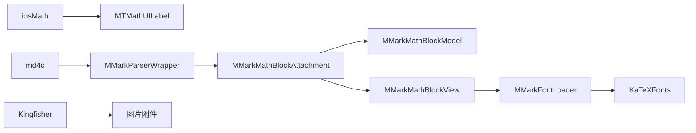

# 数学公式渲染

<cite>
**本文引用的文件**
- [MMarkMathBlockAttachment.swift](file://MMarkParser/Sources/Renderer/Attachments/MMarkMathBlockAttachment/MMarkMathBlockAttachment.swift)
- [MMarkMathBlockModel.swift](file://MMarkParser/Sources/Renderer/Attachments/MMarkMathBlockAttachment/MMarkMathBlockModel.swift)
- [MMarkMathBlockView.swift](file://MMarkParser/Sources/Renderer/Attachments/MMarkMathBlockAttachment/MMarkMathBlockView.swift)
- [MMarkMathBlockViewProvider.swift](file://MMarkParser/Sources/Renderer/Attachments/MMarkMathBlockAttachment/MMarkMathBlockViewProvider.swift)
- [MMarkFontLoader.swift](file://MMarkParser/Sources/Renderer/MMarkFontLoader.swift)
- [MMarkStyleConfiguration.swift](file://MMarkParser/Sources/Renderer/MMarkStyleConfiguration.swift)
- [CMarkParser.swift](file://MMarkParser/Sources/Parser/CMarkParser.swift)
- [MMarkParserWrapper.swift](file://MMarkParser/Sources/Parser/MMarkParserWrapper.swift)
- [MMarkTextView.swift](file://MMarkParser/Sources/Renderer/MMarkTextView.swift)
- [MMarkParser.podspec](file://MMarkParser/MMarkParser.podspec)
</cite>

## 目录
1. [简介](#简介)
2. [项目结构](#项目结构)
3. [核心组件](#核心组件)
4. [架构总览](#架构总览)
5. [详细组件分析](#详细组件分析)
6. [依赖分析](#依赖分析)
7. [性能考虑](#性能考虑)
8. [故障排查指南](#故障排查指南)
9. [结论](#结论)
10. [附录](#附录)

## 简介
本文件聚焦于 MMarkParser 的数学公式渲染能力，系统性阐述行内与块级公式的处理流程、MMarkMathBlockAttachment 架构设计（模型-视图-视图提供者）、iosMath 库集成与 KaTeX 字体加载机制、解析与渲染的尺寸计算策略、以及与 TextKit 2 的集成与渲染精度控制。同时给出配置项与自定义样式建议、复杂表达式渲染示例与性能优化要点。

## 项目结构
围绕数学公式渲染的关键目录与文件如下：
- 解析层：CMarkParser 负责启用 LaTeX 数学扩展并委托给包装器；包装器负责将 LaTeX 公式转换为可渲染的富文本或附件。
- 渲染层：MMarkMathBlockAttachment 作为 TextKit 附件承载块级数学；MMarkMathBlockModel 计算显示尺寸；MMarkMathBlockView 使用 MTMathUILabel 渲染；MMarkMathBlockViewProvider 将附件绑定到视图。
- 资源与样式：MMarkFontLoader 注册 KaTeX 字体；MMarkStyleConfiguration 提供数学样式与字体配置；MMarkTextView 集成 TextKit 2 并设置 Markdown 内容。

图表来源
- [CMarkParser.swift:55-66](file://MMarkParser/Sources/Parser/CMarkParser.swift#L55-L66)
- [MMarkParserWrapper.swift:908-933](file://MMarkParser/Sources/Parser/MMarkParserWrapper.swift#L908-L933)
- [MMarkMathBlockAttachment.swift:5-22](file://MMarkParser/Sources/Renderer/Attachments/MMarkMathBlockAttachment/MMarkMathBlockAttachment.swift#L5-L22)
- [MMarkMathBlockModel.swift:19-46](file://MMarkParser/Sources/Renderer/Attachments/MMarkMathBlockAttachment/MMarkMathBlockModel.swift#L19-L46)
- [MMarkMathBlockView.swift:7-53](file://MMarkParser/Sources/Renderer/Attachments/MMarkMathBlockAttachment/MMarkMathBlockView.swift#L7-L53)
- [MMarkMathBlockViewProvider.swift:6-23](file://MMarkParser/Sources/Renderer/Attachments/MMarkMathBlockAttachment/MMarkMathBlockViewProvider.swift#L6-L23)
- [MMarkFontLoader.swift:8-113](file://MMarkParser/Sources/Renderer/MMarkFontLoader.swift#L8-L113)
- [MMarkStyleConfiguration.swift:131-141](file://MMarkParser/Sources/Renderer/MMarkStyleConfiguration.swift#L131-L141)
- [MMarkTextView.swift:40-49](file://MMarkParser/Sources/Renderer/MMarkTextView.swift#L40-L49)

章节来源
- [CMarkParser.swift:36-46](file://MMarkParser/Sources/Parser/CMarkParser.swift#L36-L46)
- [MMarkParserWrapper.swift:908-933](file://MMarkParser/Sources/Parser/MMarkParserWrapper.swift#L908-L933)
- [MMarkTextView.swift:40-49](file://MMarkParser/Sources/Renderer/MMarkTextView.swift#L40-L49)

## 核心组件
- MMarkMathBlockAttachment：承载块级数学公式，提供尺寸约束以避免被缩进或内边距裁剪。
- MMarkMathBlockModel：计算块级公式显示尺寸，基于 iosMath 的 MTMathUILabel 在主线程测量后叠加内边距与溢出补偿。
- MMarkMathBlockView：容器视图，内部包含 UIScrollView 和 MTMathUILabel，负责渲染与滚动；根据配置应用背景色与圆角。
- MMarkMathBlockViewProvider：TextKit 视图提供者，将附件映射到对应视图并跟踪附件边界。
- MMarkFontLoader：注册 KaTeX 字体（KaTeX_Math-Italic.ttf、KaTeX_Main-Regular.ttf），确保 iosMath 正确渲染。
- MMarkStyleConfiguration：提供数学样式（行内/块级）、块级背景色与圆角、以及可选的自定义 MTFont。
- CMarkParser：启用 LaTeX 数学扩展，将 Markdown 转换为富文本。
- MMarkParserWrapper：具体实现行内与块级数学渲染逻辑，处理化学式转换与图片渲染回退。

章节来源
- [MMarkMathBlockAttachment.swift:5-22](file://MMarkParser/Sources/Renderer/Attachments/MMarkMathBlockAttachment/MMarkMathBlockAttachment.swift#L5-L22)
- [MMarkMathBlockModel.swift:7-46](file://MMarkParser/Sources/Renderer/Attachments/MMarkMathBlockAttachment/MMarkMathBlockModel.swift#L7-L46)
- [MMarkMathBlockView.swift:7-100](file://MMarkParser/Sources/Renderer/Attachments/MMarkMathBlockAttachment/MMarkMathBlockView.swift#L7-L100)
- [MMarkMathBlockViewProvider.swift:6-23](file://MMarkParser/Sources/Renderer/Attachments/MMarkMathBlockAttachment/MMarkMathBlockViewProvider.swift#L6-L23)
- [MMarkFontLoader.swift:8-113](file://MMarkParser/Sources/Renderer/MMarkFontLoader.swift#L8-L113)
- [MMarkStyleConfiguration.swift:131-141](file://MMarkParser/Sources/Renderer/MMarkStyleConfiguration.swift#L131-L141)
- [CMarkParser.swift:36-46](file://MMarkParser/Sources/Parser/CMarkParser.swift#L36-L46)
- [MMarkParserWrapper.swift:908-933](file://MMarkParser/Sources/Parser/MMarkParserWrapper.swift#L908-L933)

## 架构总览
数学公式渲染采用“解析-模型-附件-视图提供者-视图”的分层架构，结合 TextKit 2 的附件机制与 iosMath 的 LaTeX 渲染能力，实现高性能、可定制的数学公式显示。

图表来源
- [MMarkMathBlockAttachment.swift:5-22](file://MMarkParser/Sources/Renderer/Attachments/MMarkMathBlockAttachment/MMarkMathBlockAttachment.swift#L5-L22)
- [MMarkMathBlockModel.swift:7-17](file://MMarkParser/Sources/Renderer/Attachments/MMarkMathBlockAttachment/MMarkMathBlockModel.swift#L7-L17)
- [MMarkMathBlockViewProvider.swift:6-23](file://MMarkParser/Sources/Renderer/Attachments/MMarkMathBlockAttachment/MMarkMathBlockViewProvider.swift#L6-L23)
- [MMarkMathBlockView.swift:7-53](file://MMarkParser/Sources/Renderer/Attachments/MMarkMathBlockAttachment/MMarkMathBlockView.swift#L7-L53)
- [MMarkFontLoader.swift:8-26](file://MMarkParser/Sources/Renderer/MMarkFontLoader.swift#L8-L26)
- [MMarkStyleConfiguration.swift:131-141](file://MMarkParser/Sources/Renderer/MMarkStyleConfiguration.swift#L131-L141)

## 详细组件分析

### MMarkMathBlockAttachment：块级数学附件
- 职责：作为 NSTextAttachment 承载 MMarkMathBlockModel，提供 TextKit 的附件边界计算，确保在缩进与内边距场景下不被裁剪。
- 关键点：attachmentBounds 中对宽度进行约束，避免右边缘被块引用或列表缩进导致的角落裁切。

章节来源
- [MMarkMathBlockAttachment.swift:16-21](file://MMarkParser/Sources/Renderer/Attachments/MMarkMathBlockAttachment/MMarkMathBlockAttachment.swift#L16-L21)

### MMarkMathBlockModel：块级数学模型
- 职责：计算并保存块级公式的显示尺寸，包含 LaTeX 文本宽高与整体尺寸。
- 尺寸计算策略：
  - 在主线程创建 MTMathUILabel 并设置 LaTeX 与模式（显示模式）。
  - 依据配置优先使用自定义 MTFont，否则使用 mathBlockStyle 的字号与颜色。
  - sizeToFit 后对高度进行补偿，以避免高表达式（矩阵、分数等）因 drawRect CGContext 裁剪导致的截断。
  - 最终尺寸叠加内边距与标签边距，形成稳定布局。

图表来源
- [MMarkMathBlockModel.swift:25-39](file://MMarkParser/Sources/Renderer/Attachments/MMarkMathBlockAttachment/MMarkMathBlockModel.swift#L25-L39)
- [MMarkMathBlockModel.swift:41-46](file://MMarkParser/Sources/Renderer/Attachments/MMarkMathBlockAttachment/MMarkMathBlockModel.swift#L41-L46)

章节来源
- [MMarkMathBlockModel.swift:19-46](file://MMarkParser/Sources/Renderer/Attachments/MMarkMathBlockAttachment/MMarkMathBlockModel.swift#L19-L46)

### MMarkMathBlockView：块级数学视图
- 职责：承载 UIScrollView 与 MTMathUILabel，实现横向滚动与内容适配；根据配置设置背景色与圆角。
- 关键点：
  - 初始化时调用 MMarkFontLoader.ensureFontsRegistered() 确保 KaTeX 字体可用。
  - 对 MTMathUILabel 进行 sizeToFit 后微调 frame，补偿溢出区域，再设置 UIScrollView 的 contentSize。
  - 使用约束将内部滚动视图与容器内边距对齐。

图表来源
- [MMarkMathBlockView.swift:19-53](file://MMarkParser/Sources/Renderer/Attachments/MMarkMathBlockAttachment/MMarkMathBlockView.swift#L19-L53)
- [MMarkFontLoader.swift:24-26](file://MMarkParser/Sources/Renderer/MMarkFontLoader.swift#L24-L26)

章节来源
- [MMarkMathBlockView.swift:7-100](file://MMarkParser/Sources/Renderer/Attachments/MMarkMathBlockAttachment/MMarkMathBlockView.swift#L7-L100)

### MMarkMathBlockViewProvider：视图提供者
- 职责：将 MMarkMathBlockAttachment 映射到 MMarkMathBlockView，并声明跟踪附件边界，使 TextKit 能正确布局。
- 关键点：loadView 中安全断言附件类型，创建视图并设置 tracksTextAttachmentViewBounds。

章节来源
- [MMarkMathBlockViewProvider.swift:12-22](file://MMarkParser/Sources/Renderer/Attachments/MMarkMathBlockAttachment/MMarkMathBlockViewProvider.swift#L12-L22)

### MMarkFontLoader：KaTeX 字体加载
- 职责：从资源包中注册 KaTeX 字体（KaTeX_Math-Italic.ttf、KaTeX_Main-Regular.ttf），保证 iosMath 渲染质量。
- 机制：
  - 多策略查找字体文件（子目录、根目录、资源路径）。
  - 使用 CTFontManagerRegisterGraphicsFont 注册字体。
  - 线程安全：通过 NSLock 保护注册状态与并发访问。

章节来源
- [MMarkFontLoader.swift:28-51](file://MMarkParser/Sources/Renderer/MMarkFontLoader.swift#L28-L51)
- [MMarkFontLoader.swift:67-111](file://MMarkParser/Sources/Renderer/MMarkFontLoader.swift#L67-L111)

### MMarkStyleConfiguration：数学样式与字体配置
- 行内与块级数学样式：mathInlineStyle、mathBlockStyle。
- 块级数学外观：mathBlockBackgroundColor、mathBlockCornerRadius。
- 自定义渲染字体：mathDisplayFont（优先使用），否则回退到默认字体。
- 默认样式：优先尝试 KaTeX 字体，失败则回退系统字体。

章节来源
- [MMarkStyleConfiguration.swift:131-141](file://MMarkParser/Sources/Renderer/MMarkStyleConfiguration.swift#L131-L141)
- [MMarkStyleConfiguration.swift:189-267](file://MMarkParser/Sources/Renderer/MMarkStyleConfiguration.swift#L189-L267)

### 解析与渲染流程（行内与块级）
- 块级公式（$$...$$）：
  - 包装器 renderBlockMath：转换化学式 → 创建 MMarkMathBlockModel → 创建 MMarkMathBlockAttachment → 输出富文本。
- 行内公式（$...$）：
  - 包装器 renderInlineMath：转换化学式 → 使用 MTMathUILabel 渲染为图片（若失败则回退为普通文本样式）。

图表来源
- [CMarkParser.swift:36-46](file://MMarkParser/Sources/Parser/CMarkParser.swift#L36-L46)
- [CMarkParser.swift:55-66](file://MMarkParser/Sources/Parser/CMarkParser.swift#L55-L66)
- [MMarkParserWrapper.swift:908-927](file://MMarkParser/Sources/Parser/MMarkParserWrapper.swift#L908-L927)
- [MMarkMathBlockModel.swift:19-46](file://MMarkParser/Sources/Renderer/Attachments/MMarkMathBlockAttachment/MMarkMathBlockModel.swift#L19-L46)

章节来源
- [MMarkParserWrapper.swift:908-933](file://MMarkParser/Sources/Parser/MMarkParserWrapper.swift#L908-L933)
- [MMarkParserWrapper.swift:1150-1174](file://MMarkParser/Sources/Parser/MMarkParserWrapper.swift#L1150-L1174)

## 依赖分析
- 外部依赖：
  - iosMath：LaTeX 渲染核心（MTMathUILabel）。
  - md4c：Markdown 解析与回调接口。
  - Kingfisher：图片加载（与数学公式渲染无直接耦合）。
- 资源依赖：
  - MMarkParser.bundle/KaTeXFonts：包含 KaTeX 字体文件，由 MMarkFontLoader 注册。

图表来源
- [MMarkParser.podspec:15-17](file://MMarkParser/MMarkParser.podspec#L15-L17)
- [MMarkFontLoader.swift:54-64](file://MMarkParser/Sources/Renderer/MMarkFontLoader.swift#L54-L64)

章节来源
- [MMarkParser.podspec:15-17](file://MMarkParser/MMarkParser.podspec#L15-L17)
- [MMarkFontLoader.swift:54-64](file://MMarkParser/Sources/Renderer/MMarkFontLoader.swift#L54-L64)

## 性能考虑
- 主线程测量：MMMathUILabel 的 sizeToFit 必须在主线程执行，模型工厂方法与行内渲染均通过主线程同步封装，避免并发导致的不可预期行为。
- 字体注册幂等：MMarkFontLoader 仅在首次调用时注册字体，后续调用直接返回，避免重复开销。
- 滚动与溢出：块级视图通过 UIScrollView 与微调 frame 避免裁剪，减少重绘与布局抖动。
- 容器宽度约束：附件边界计算限制宽度，避免不必要的超宽布局与重排。
- 建议：
  - 控制容器宽度，避免过宽导致 MTMathUILabel 测量成本上升。
  - 复用 MMarkStyleConfiguration，减少频繁切换字体与颜色带来的重绘。
  - 对长公式启用横向滚动，避免过高的 label 导致滚动视图频繁调整。

章节来源
- [MMarkMathBlockModel.swift:25-39](file://MMarkParser/Sources/Renderer/Attachments/MMarkMathBlockAttachment/MMarkMathBlockModel.swift#L25-L39)
- [MMarkMathBlockView.swift:44-52](file://MMarkParser/Sources/Renderer/Attachments/MMarkMathBlockAttachment/MMarkMathBlockView.swift#L44-L52)
- [MMarkFontLoader.swift:24-26](file://MMarkParser/Sources/Renderer/MMarkFontLoader.swift#L24-L26)

## 故障排查指南
- 公式未显示或显示异常：
  - 确认已调用 MMarkFontLoader.ensureFontsRegistered() 或在初始化视图时触发字体注册。
  - 检查 mathDisplayFont 是否正确设置；若为空则回退到默认字体。
- 高公式（矩阵、分数）底部被截断：
  - 确认已对 MTMathUILabel 进行高度补偿与 frame 微调。
- 布局被缩进或内边距裁切：
  - 检查 MMarkMathBlockAttachment 的 attachmentBounds 实现是否生效。
- 行内公式渲染失败回退为纯文本：
  - 当 MTMathUILabel 测量宽高为零时会回退到 mathInlineStyle 样式文本，检查 LaTeX 内容与字体配置。

章节来源
- [MMarkFontLoader.swift:24-26](file://MMarkParser/Sources/Renderer/MMarkFontLoader.swift#L24-L26)
- [MMarkStyleConfiguration.swift:131-141](file://MMarkParser/Sources/Renderer/MMarkStyleConfiguration.swift#L131-L141)
- [MMarkMathBlockView.swift:44-52](file://MMarkParser/Sources/Renderer/Attachments/MMarkMathBlockAttachment/MMarkMathBlockView.swift#L44-L52)
- [MMarkMathBlockAttachment.swift:16-21](file://MMarkParser/Sources/Renderer/Attachments/MMarkMathBlockAttachment/MMarkMathBlockAttachment.swift#L16-L21)
- [MMarkParserWrapper.swift:1166-1174](file://MMarkParser/Sources/Parser/MMarkParserWrapper.swift#L1166-L1174)

## 结论
MMarkParser 的数学公式渲染以 TextKit 2 为核心，结合 iosMath 与 KaTeX 字体，实现了行内与块级公式的高质量渲染。通过模型-视图-视图提供者的清晰分工与严格的主线程测量策略，系统在保证渲染精度的同时兼顾了性能与可维护性。合理配置样式与字体，配合滚动与溢出补偿，可满足复杂表达式的稳定显示需求。

## 附录

### 配置选项与自定义样式
- 行内数学样式：mathInlineStyle（字体、文本色、背景色）。
- 块级数学样式：mathBlockStyle（字体、文本色）。
- 块级外观：mathBlockBackgroundColor、mathBlockCornerRadius。
- 自定义渲染字体：mathDisplayFont（优先使用）。
- 默认回退：优先 KaTeX 字体，失败回退系统字体。

章节来源
- [MMarkStyleConfiguration.swift:131-141](file://MMarkParser/Sources/Renderer/MMarkStyleConfiguration.swift#L131-L141)
- [MMarkStyleConfiguration.swift:189-267](file://MMarkParser/Sources/Renderer/MMarkStyleConfiguration.swift#L189-L267)

### 与 TextKit 2 的集成与渲染精度控制
- 附件边界：MMarkMathBlockAttachment 提供精确的 bounds 计算，避免被缩进与内边距裁切。
- 视图跟踪：MMarkMathBlockViewProvider 声明跟踪附件边界，使 TextKit 能正确布局。
- 渲染精度：MTMathUILabel 在主线程测量，确保 frame 与 contentSize 准确；通过滚动与溢出补偿提升高表达式渲染完整性。

章节来源
- [MMarkMathBlockAttachment.swift:16-21](file://MMarkParser/Sources/Renderer/Attachments/MMarkMathBlockAttachment/MMarkMathBlockAttachment.swift#L16-L21)
- [MMarkMathBlockViewProvider.swift:20-22](file://MMarkParser/Sources/Renderer/Attachments/MMarkMathBlockAttachment/MMarkMathBlockViewProvider.swift#L20-L22)
- [MMarkMathBlockView.swift:44-52](file://MMarkParser/Sources/Renderer/Attachments/MMarkMathBlockAttachment/MMarkMathBlockView.swift#L44-L52)

### 复杂表达式渲染示例（概念性说明）
- 分数、根号、上下标组合：通过 MTMathUILabel 的 sizeToFit 与高度补偿，确保完整显示。
- 矩阵与多行列式：使用横向滚动视图承载，避免过宽导致的布局问题。
- 化学式转换：包装器将 \ce{...} 与 \chemfig{...} 转换为 LaTeX 文本后再渲染。

章节来源
- [MMarkParserWrapper.swift:935-950](file://MMarkParser/Sources/Parser/MMarkParserWrapper.swift#L935-L950)
- [MMarkParserWrapper.swift:1082-1092](file://MMarkParser/Sources/Parser/MMarkParserWrapper.swift#L1082-L1092)