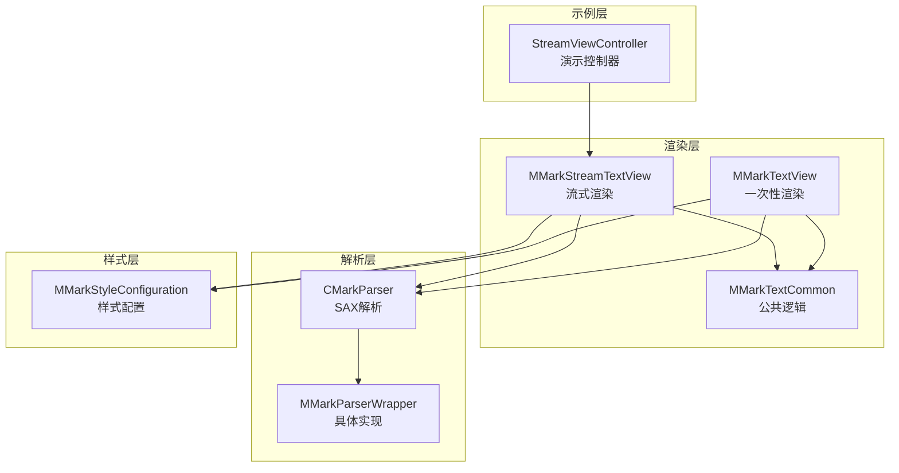
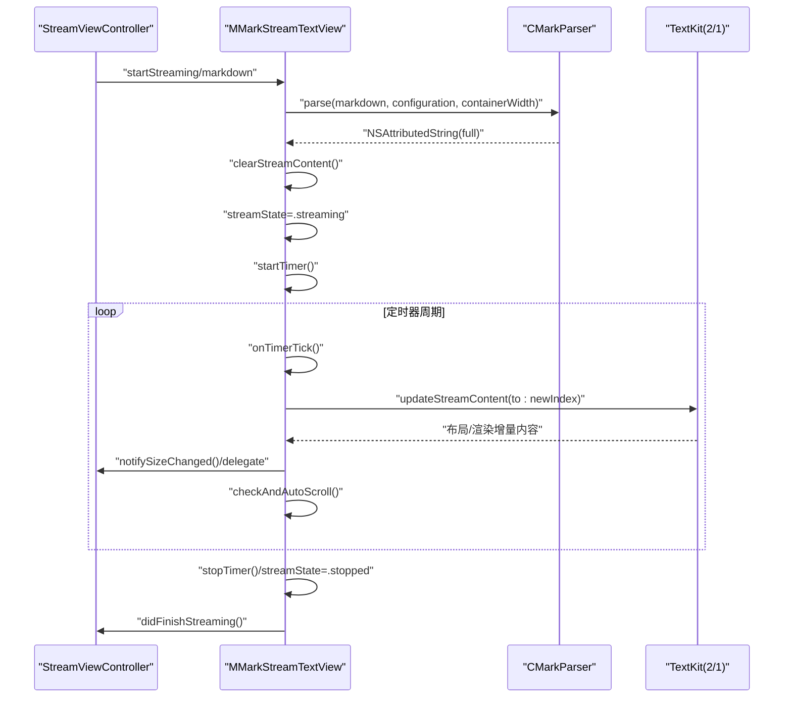
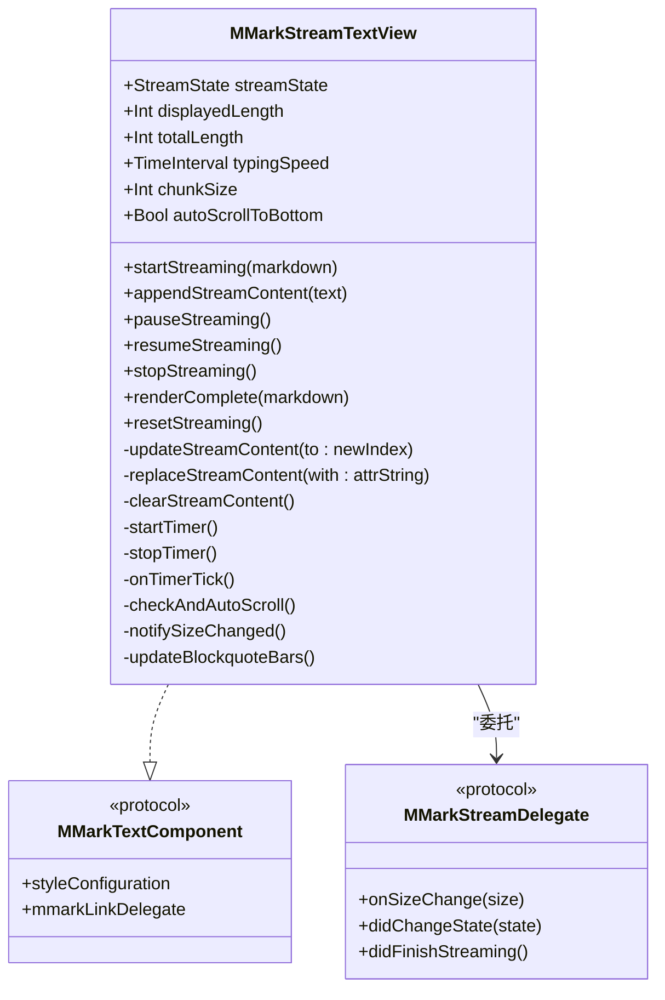
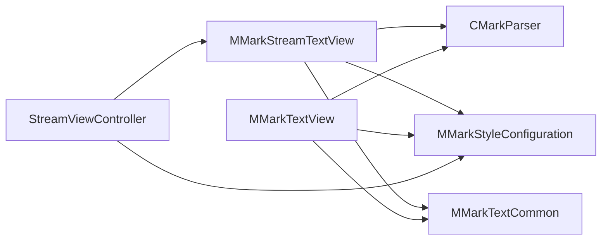
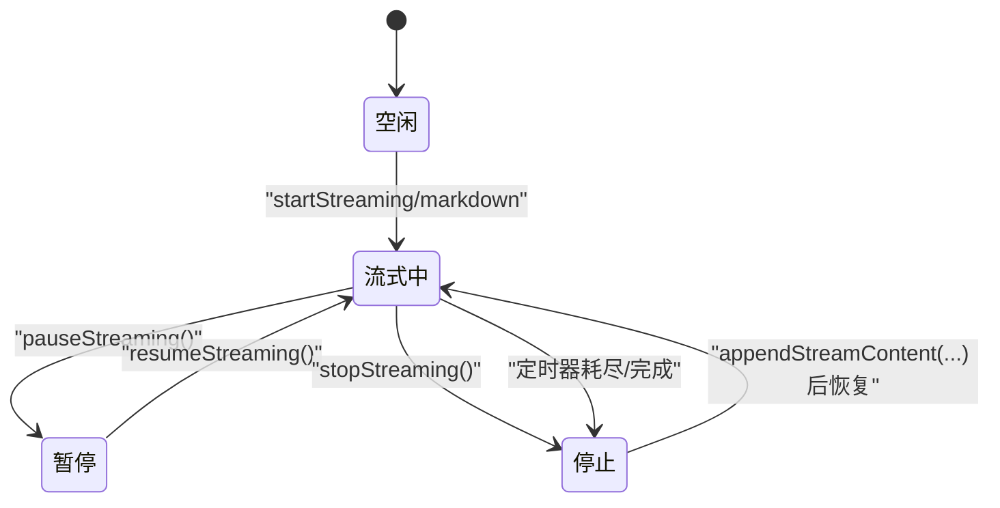

# 流式渲染功能

<cite>
**本文档引用的文件**
- [MMarkStreamTextView.swift](file://MMarkParser/Sources/Renderer/MMarkStreamTextView.swift)
- [MMarkTextView.swift](file://MMarkParser/Sources/Renderer/MMarkTextView.swift)
- [MMarkTextCommon.swift](file://MMarkParser/Sources/Renderer/MMarkTextCommon.swift)
- [CMarkParser.swift](file://MMarkParser/Sources/Parser/CMarkParser.swift)
- [MMarkParserWrapper.swift](file://MMarkParser/Sources/Parser/MMarkParserWrapper.swift)
- [MMarkStyleConfiguration.swift](file://MMarkParser/Sources/Renderer/MMarkStyleConfiguration.swift)
- [StreamViewController.swift](file://cocoapod_demo/cocoapod_demo/StreamViewController.swift)
</cite>

## 目录
1. [简介](#简介)
2. [项目结构](#项目结构)
3. [核心组件](#核心组件)
4. [架构总览](#架构总览)
5. [详细组件分析](#详细组件分析)
6. [依赖关系分析](#依赖关系分析)
7. [性能考量](#性能考量)
8. [故障排查指南](#故障排查指南)
9. [结论](#结论)
10. [附录](#附录)

## 简介
本文件面向MMarkParser的流式渲染能力，重点阐述MMarkStreamTextView的实现原理与使用方法，涵盖以下主题：
- 增量渲染机制与定时器驱动的内容更新
- 状态管理（idle、streaming、paused、stopped）
- 自动滚动与尺寸变化通知
- TextKit 2集成与TextKit 1兼容回退
- 配置项（typingSpeed、chunkSize、autoScrollToBottom）
- 使用示例（实时内容更新、暂停/恢复、停止）
- 与传统一次性渲染的性能对比与适用场景

## 项目结构
围绕流式渲染的相关模块组织如下：
- 渲染层：MMarkStreamTextView（流式渲染）、MMarkTextView（一次性渲染）、MMarkTextCommon（公共逻辑）
- 解析层：CMarkParser（基于md4c的SAX解析）、MMarkParserWrapper（具体实现）
- 样式层：MMarkStyleConfiguration（样式配置）
- 示例层：StreamViewController（演示控制器）

**图表来源**
- [MMarkStreamTextView.swift:1-398](file://MMarkParser/Sources/Renderer/MMarkStreamTextView.swift#L1-L398)
- [MMarkTextView.swift:1-81](file://MMarkParser/Sources/Renderer/MMarkTextView.swift#L1-L81)
- [MMarkTextCommon.swift:1-295](file://MMarkParser/Sources/Renderer/MMarkTextCommon.swift#L1-L295)
- [CMarkParser.swift:1-81](file://MMarkParser/Sources/Parser/CMarkParser.swift#L1-L81)
- [MMarkParserWrapper.swift:1-1446](file://MMarkParser/Sources/Parser/MMarkParserWrapper.swift#L1-L1446)
- [MMarkStyleConfiguration.swift:1-339](file://MMarkParser/Sources/Renderer/MMarkStyleConfiguration.swift#L1-L339)
- [StreamViewController.swift:1-279](file://cocoapod_demo/cocoapod_demo/StreamViewController.swift#L1-L279)

**章节来源**
- [MMarkStreamTextView.swift:1-398](file://MMarkParser/Sources/Renderer/MMarkStreamTextView.swift#L1-L398)
- [MMarkTextView.swift:1-81](file://MMarkParser/Sources/Renderer/MMarkTextView.swift#L1-L81)
- [MMarkTextCommon.swift:1-295](file://MMarkParser/Sources/Renderer/MMarkTextCommon.swift#L1-L295)
- [CMarkParser.swift:1-81](file://MMarkParser/Sources/Parser/CMarkParser.swift#L1-L81)
- [MMarkParserWrapper.swift:1-1446](file://MMarkParser/Sources/Parser/MMarkParserWrapper.swift#L1-L1446)
- [MMarkStyleConfiguration.swift:1-339](file://MMarkParser/Sources/Renderer/MMarkStyleConfiguration.swift#L1-L339)
- [StreamViewController.swift:1-279](file://cocoapod_demo/cocoapod_demo/StreamViewController.swift#L1-L279)

## 核心组件
- MMarkStreamTextView：支持增量流式渲染的UITextView，具备定时器驱动的增量更新、状态机、自动滚动与尺寸通知。
- MMarkTextView：一次性渲染Markdown的UITextView，用于对比与传统渲染场景。
- MMarkTextCommon：提供公共逻辑，如附件视图注册、链接处理、引用块侧边条渲染（TextKit 2/1双路径）。
- CMarkParser：基于md4c的SAX解析器，负责将Markdown转换为NSAttributedString。
- MMarkStyleConfiguration：样式配置对象，影响渲染外观与行为。
- StreamViewController：演示控制器，展示流式渲染的控制与交互。

**章节来源**
- [MMarkStreamTextView.swift:1-398](file://MMarkParser/Sources/Renderer/MMarkStreamTextView.swift#L1-L398)
- [MMarkTextView.swift:1-81](file://MMarkParser/Sources/Renderer/MMarkTextView.swift#L1-L81)
- [MMarkTextCommon.swift:1-295](file://MMarkParser/Sources/Renderer/MMarkTextCommon.swift#L1-L295)
- [CMarkParser.swift:1-81](file://MMarkParser/Sources/Parser/CMarkParser.swift#L1-L81)
- [MMarkStyleConfiguration.swift:1-339](file://MMarkParser/Sources/Renderer/MMarkStyleConfiguration.swift#L1-L339)
- [StreamViewController.swift:1-279](file://cocoapod_demo/cocoapod_demo/StreamViewController.swift#L1-L279)

## 架构总览
MMarkStreamTextView通过“解析线程 + 主线程”的分工实现流式渲染：
- 解析线程：使用CMarkParser将Markdown解析为NSAttributedString，避免主线程阻塞。
- 主线程：定时器周期性推进显示索引，增量更新textStorage或NSTextContentStorage，触发TextKit布局与渲染。
- 状态机：维护idle/streaming/paused/stopped四种状态，驱动定时器启停与UI反馈。
- 兼容层：在iOS 16+使用TextKit 2的NSTextLayoutManager/NSTextContentStorage；在iOS 15使用TextKit 1的NSTextStorage。

**图表来源**
- [MMarkStreamTextView.swift:174-351](file://MMarkParser/Sources/Renderer/MMarkStreamTextView.swift#L174-L351)
- [CMarkParser.swift:55-66](file://MMarkParser/Sources/Parser/CMarkParser.swift#L55-L66)
- [StreamViewController.swift:208-232](file://cocoapod_demo/cocoapod_demo/StreamViewController.swift#L208-L232)

**章节来源**
- [MMarkStreamTextView.swift:174-351](file://MMarkParser/Sources/Renderer/MMarkStreamTextView.swift#L174-L351)
- [CMarkParser.swift:55-66](file://MMarkParser/Sources/Parser/CMarkParser.swift#L55-L66)
- [StreamViewController.swift:208-232](file://cocoapod_demo/cocoapod_demo/StreamViewController.swift#L208-L232)

## 详细组件分析

### MMarkStreamTextView：流式渲染核心
- 状态机与生命周期
  - idle：初始或重置状态，等待开始。
  - streaming：正在增量渲染，定时器运行。
  - paused：暂停渲染，定时器停止。
  - stopped：停止渲染，可选择立即渲染完整内容或保持当前进度。
- 增量渲染机制
  - 维护fullAttrString与displayIndex，按chunkSize推进显示长度。
  - iOS 16+使用NSTextContentStorage.performEditingTransaction增量追加；iOS 15回退至NSTextStorage。
  - 当新内容长度小于当前显示长度时，执行全量替换以保证一致性。
- 定时器驱动
  - timerQueue以typingSpeed毫秒为周期触发onTimerTick。
  - 动态chunkSize：当显示长度超过阈值时自动增大chunkSize，维持流畅的视觉体验。
- 自动滚动与尺寸通知
  - autoScrollToBottom：当用户位于底部附近时，滚动到底部。
  - notifySizeChanged：通过sizeThatFits估算内容高度，避免强制激活TextKit 1桥接，减少开销。
- TextKit 2集成与兼容
  - iOS 16+：使用textLayoutManager与NSTextContentStorage，避免全量重布局。
  - iOS 15：使用NSTextStorage，兼容旧系统。
- 链接与附件
  - 实现UITextViewDelegate，统一处理链接点击与脚注/锚点跳转。
  - 注册各类附件视图提供者，支持代码块、表格、数学公式、图片、列表标记等。

**图表来源**
- [MMarkStreamTextView.swift:21-398](file://MMarkParser/Sources/Renderer/MMarkStreamTextView.swift#L21-L398)

**章节来源**
- [MMarkStreamTextView.swift:21-398](file://MMarkParser/Sources/Renderer/MMarkStreamTextView.swift#L21-L398)

### MMarkTextView：一次性渲染对比
- 提供setMarkdown接口，解析并一次性设置attributedText。
- 监听contentSize变化，延迟触发引用块侧边条更新，避免频繁重绘。
- 与MMarkStreamTextView共享链接处理与附件视图注册逻辑。

**章节来源**
- [MMarkTextView.swift:1-81](file://MMarkParser/Sources/Renderer/MMarkTextView.swift#L1-L81)
- [MMarkTextCommon.swift:1-295](file://MMarkParser/Sources/Renderer/MMarkTextCommon.swift#L1-L295)

### MMarkTextCommon：公共逻辑与兼容层
- 附件视图注册：统一注册代码块、表格、数学公式、图片、列表标记等视图提供者。
- 链接处理：优先回调外部代理，其次处理脚注与锚点跳转，最后判断是否为Web链接。
- 引用块侧边条渲染：TextKit 2路径使用NSTextLayoutManager枚举布局片段，计算最小包围矩形；TextKit 1路径使用layoutManager.enumerateLineFragments遍历行片段，兼容旧系统。

**章节来源**
- [MMarkTextCommon.swift:1-295](file://MMarkParser/Sources/Renderer/MMarkTextCommon.swift#L1-L295)

### CMarkParser与MMarkParserWrapper：解析实现
- CMarkParser：封装md4c的SAX回调，提供ParseOptions与parse接口，返回NSAttributedString。
- MMarkParserWrapper：内部实现，负责构建NSAttributedString，处理块/行/内联元素，维护容器宽度与缩进，输出带属性的字符串与附件。

**章节来源**
- [CMarkParser.swift:1-81](file://MMarkParser/Sources/Parser/CMarkParser.swift#L1-L81)
- [MMarkParserWrapper.swift:1-1446](file://MMarkParser/Sources/Parser/MMarkParserWrapper.swift#L1-L1446)

### MMarkStyleConfiguration：样式配置
- 包含标题、段落、代码、链接、删除线、引用块、图片、表格、任务列表、数学公式、脚注等样式字段。
- 提供defaultStyle默认配置，便于快速使用。

**章节来源**
- [MMarkStyleConfiguration.swift:1-339](file://MMarkParser/Sources/Renderer/MMarkStyleConfiguration.swift#L1-L339)

### StreamViewController：使用示例
- 展示如何配置typingSpeed、chunkSize，以及start/pause/resume/stop/append/renderComplete等API。
- 通过MMarkStreamDelegate监听尺寸变化与状态切换，实现自动滚动与进度提示。

**章节来源**
- [StreamViewController.swift:1-279](file://cocoapod_demo/cocoapod_demo/StreamViewController.swift#L1-L279)

## 依赖关系分析
- MMarkStreamTextView依赖：
  - CMarkParser：解析Markdown为NSAttributedString
  - MMarkStyleConfiguration：样式配置
  - MMarkTextCommon：公共逻辑（附件注册、链接处理、引用块渲染）
  - UIKit：UITextView、NSTextStorage、NSTextLayoutManager、CALayer等
- MMarkTextView依赖：
  - 同上，但不涉及定时器与增量更新
- StreamViewController依赖：
  - MMarkStreamTextView与MMarkStyleConfiguration，演示API使用

**图表来源**
- [MMarkStreamTextView.swift:1-398](file://MMarkParser/Sources/Renderer/MMarkStreamTextView.swift#L1-L398)
- [MMarkTextView.swift:1-81](file://MMarkParser/Sources/Renderer/MMarkTextView.swift#L1-L81)
- [MMarkTextCommon.swift:1-295](file://MMarkParser/Sources/Renderer/MMarkTextCommon.swift#L1-L295)
- [CMarkParser.swift:1-81](file://MMarkParser/Sources/Parser/CMarkParser.swift#L1-L81)
- [MMarkStyleConfiguration.swift:1-339](file://MMarkParser/Sources/Renderer/MMarkStyleConfiguration.swift#L1-L339)
- [StreamViewController.swift:1-279](file://cocoapod_demo/cocoapod_demo/StreamViewController.swift#L1-L279)

**章节来源**
- [MMarkStreamTextView.swift:1-398](file://MMarkParser/Sources/Renderer/MMarkStreamTextView.swift#L1-L398)
- [MMarkTextView.swift:1-81](file://MMarkParser/Sources/Renderer/MMarkTextView.swift#L1-L81)
- [MMarkTextCommon.swift:1-295](file://MMarkParser/Sources/Renderer/MMarkTextCommon.swift#L1-L295)
- [CMarkParser.swift:1-81](file://MMarkParser/Sources/Parser/CMarkParser.swift#L1-L81)
- [MMarkStyleConfiguration.swift:1-339](file://MMarkParser/Sources/Renderer/MMarkStyleConfiguration.swift#L1-L339)
- [StreamViewController.swift:1-279](file://cocoapod_demo/cocoapod_demo/StreamViewController.swift#L1-L279)

## 性能考量
- 解析与渲染分离
  - 解析在独立队列执行，避免阻塞主线程，提升响应性。
- 增量更新与动态chunk
  - 通过定时器周期性推进显示索引，避免一次性全量渲染带来的卡顿。
  - 长文档自动增大chunkSize，维持视觉流畅度。
- TextKit 2优化
  - iOS 16+使用NSTextContentStorage.performEditingTransaction，避免全量重布局，显著降低布局成本。
- 尺寸计算优化
  - 通过sizeThatFits估算高度，避免强制激活TextKit 1桥接，减少不必要的初始化开销。
- 引用块渲染
  - 引用块侧边条在变更时才重建，且在TextKit 2路径中使用布局片段枚举，避免遍历整段文本。

**章节来源**
- [MMarkStreamTextView.swift:112-170](file://MMarkParser/Sources/Renderer/MMarkStreamTextView.swift#L112-L170)
- [MMarkStreamTextView.swift:304-351](file://MMarkParser/Sources/Renderer/MMarkStreamTextView.swift#L304-L351)
- [MMarkTextCommon.swift:136-254](file://MMarkParser/Sources/Renderer/MMarkTextCommon.swift#L136-L254)

## 故障排查指南
- 定时器未启动
  - 检查streamState是否为streaming，确认startTimer被调用。
  - 确认timerQueue与timer实例未被提前释放。
- 增量更新无效
  - 确认fullAttrString已生成且长度大于displayedLength。
  - 检查iOS版本分支：iOS 16+使用NSTextContentStorage，iOS 15使用NSTextStorage。
- 自动滚动不生效
  - 检查autoScrollToBottom开关与阈值判定逻辑。
  - 确认contentSize变化后触发了scrollToBottom。
- 尺寸通知抖动
  - 通过lastNotifiedSize进行阈值比较，避免频繁回调。
- 引用块侧边条不显示
  - 确认attributedText包含blockquote属性与blockquoteDepth。
  - 检查TextKit 2路径是否正确获取布局片段范围。

**章节来源**
- [MMarkStreamTextView.swift:304-387](file://MMarkParser/Sources/Renderer/MMarkStreamTextView.swift#L304-L387)
- [MMarkTextCommon.swift:136-254](file://MMarkParser/Sources/Renderer/MMarkTextCommon.swift#L136-L254)

## 结论
MMarkStreamTextView通过“解析线程 + 主线程增量更新 + 定时器驱动”的架构，实现了高性能、低卡顿的Markdown流式渲染。其状态机清晰、兼容TextKit 2/1、支持自动滚动与尺寸通知，并提供了丰富的配置项与演示示例。相比一次性渲染，流式渲染更适合长文档与实时内容更新场景，能够显著提升用户体验。

## 附录

### 流式渲染状态转换

**图表来源**
- [MMarkStreamTextView.swift:25-300](file://MMarkParser/Sources/Renderer/MMarkStreamTextView.swift#L25-L300)

### 配置选项与使用示例
- 配置项
  - typingSpeed：每帧增量插入的时长（秒），决定定时器周期。
  - chunkSize：单次增量插入的字符数，长文档可自动增大。
  - autoScrollToBottom：是否自动滚动到底部。
  - styleConfiguration：样式配置对象。
- 使用示例
  - 开始流式：startStreaming(markdown)
  - 追加内容：appendStreamContent(text)
  - 暂停/恢复/停止：pauseStreaming/resumeStreaming/stopStreaming
  - 渲染完成：renderComplete(markdown)
  - 重置：resetStreaming

**章节来源**
- [MMarkStreamTextView.swift:34-41](file://MMarkParser/Sources/Renderer/MMarkStreamTextView.swift#L34-L41)
- [StreamViewController.swift:208-245](file://cocoapod_demo/cocoapod_demo/StreamViewController.swift#L208-L245)

### 与传统渲染的性能对比
- 一次性渲染（MMarkTextView）
  - 优点：实现简单，适合短文档或静态内容。
  - 缺点：长文档解析与布局可能造成主线程阻塞，首屏时间较长。
- 流式渲染（MMarkStreamTextView）
  - 优点：解析与渲染分离，定时器驱动增量更新，长文档体验更佳。
  - 缺点：实现复杂度较高，需处理状态机与兼容层。

**章节来源**
- [MMarkTextView.swift:39-49](file://MMarkParser/Sources/Renderer/MMarkTextView.swift#L39-L49)
- [MMarkStreamTextView.swift:174-201](file://MMarkParser/Sources/Renderer/MMarkStreamTextView.swift#L174-L201)