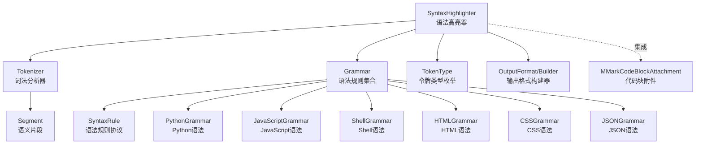
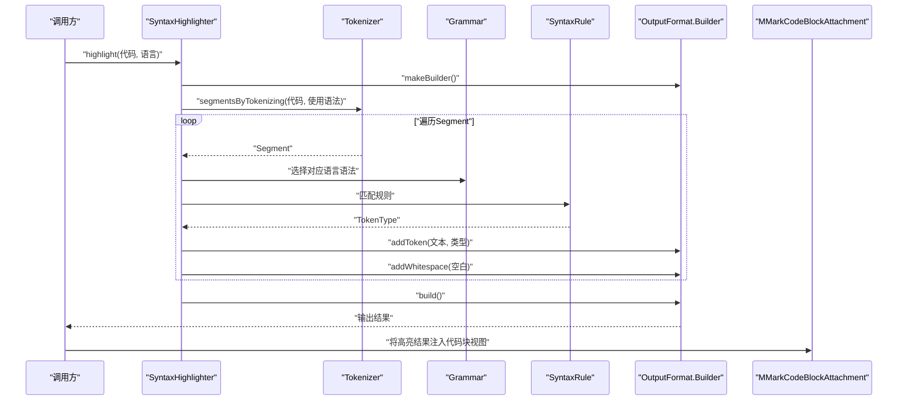
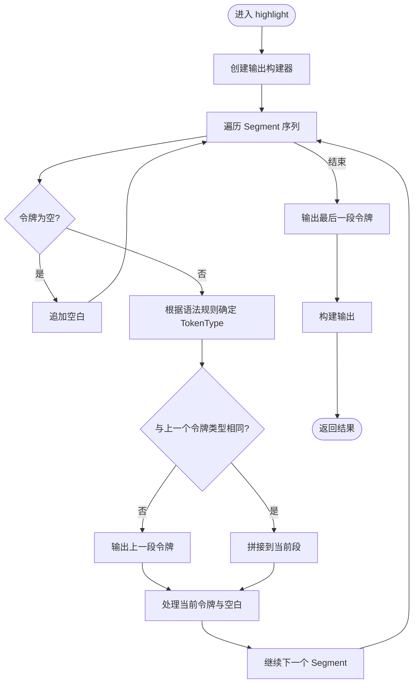
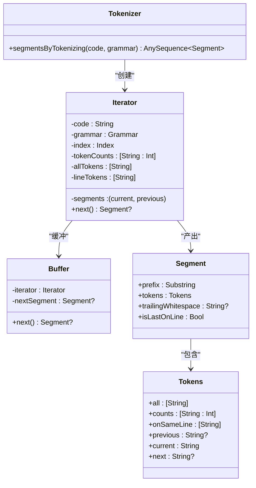
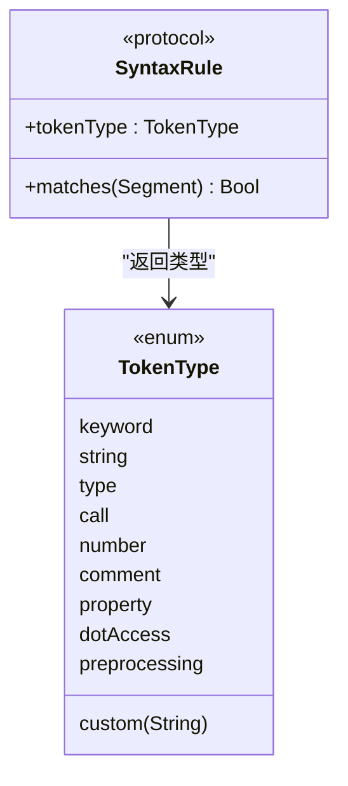
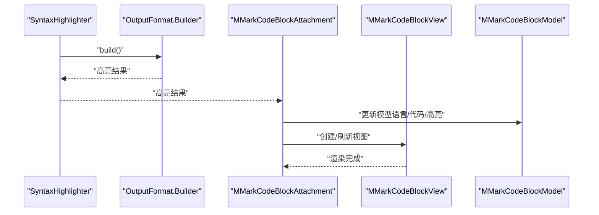
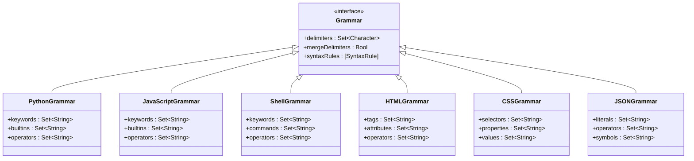
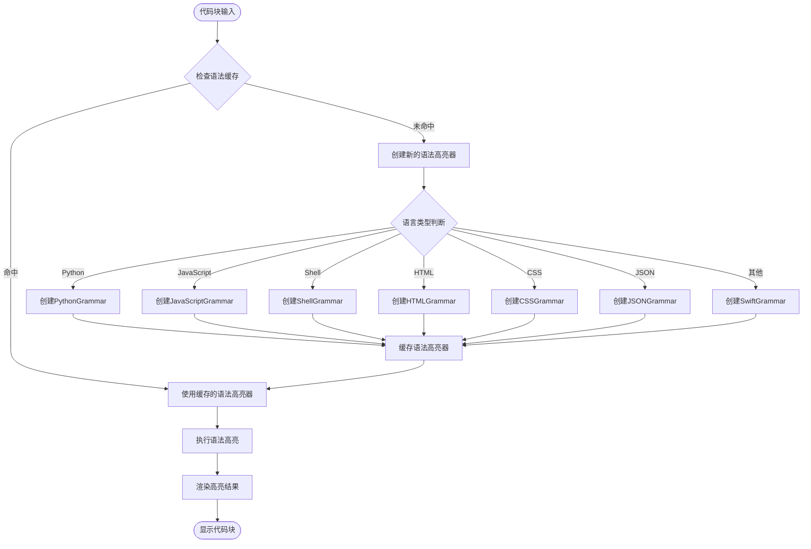
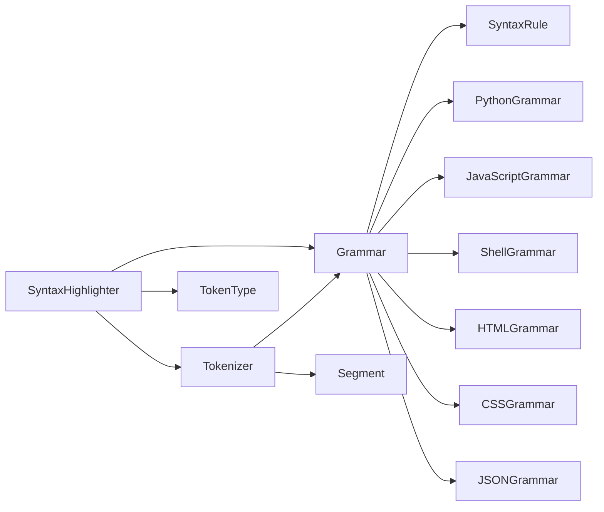

# 语法高亮功能

<cite>
**本文引用的文件**
- [SyntaxHighlighter.swift](file://MMarkParser/Sources/Splash/Syntax/SyntaxHighlighter.swift)
- [SyntaxRule.swift](file://MMarkParser/Sources/Splash/Syntax/SyntaxRule.swift)
- [SplashTokenizer.swift](file://MMarkParser/Sources/Splash/Tokenizing/SplashTokenizer.swift)
- [TokenType.swift](file://MMarkParser/Sources/Splash/Tokenizing/TokenType.swift)
- [Segment.swift](file://MMarkParser/Sources/Splash/Tokenizing/Segment.swift)
- [SwiftGrammar.swift](file://MMarkParser/Sources/Splash/Grammar/SwiftGrammar.swift)
- [PythonGrammar.swift](file://MMarkParser/Sources/Splash/Grammar/PythonGrammar.swift)
- [JavaScriptGrammar.swift](file://MMarkParser/Sources/Splash/Grammar/JavaScriptGrammar.swift)
- [ShellGrammar.swift](file://MMarkParser/Sources/Splash/Grammar/ShellGrammar.swift)
- [HTMLGrammar.swift](file://MMarkParser/Sources/Splash/Grammar/HTMLGrammar.swift)
- [CSSGrammar.swift](file://MMarkParser/Sources/Splash/Grammar/CSSGrammar.swift)
- [JSONGrammar.swift](file://MMarkParser/Sources/Splash/Grammar/JSONGrammar.swift)
- [Grammar.swift](file://MMarkParser/Sources/Splash/Grammar/Grammar.swift)
- [MMarkCodeBlockAttachment.swift](file://MMarkParser/Sources/Renderer/Attachments/MMarkCodeBlockAttachment/MMarkCodeBlockAttachment.swift)
- [MMarkCodeBlockModel.swift](file://MMarkParser/Sources/Renderer/Attachments/MMarkCodeBlockAttachment/MMarkCodeBlockModel.swift)
- [MMarkCodeBlockView.swift](file://MMarkParser/Sources/Renderer/Attachments/MMarkCodeBlockAttachment/MMarkCodeBlockView.swift)
- [MMarkCodeBlockViewProvider.swift](file://MMarkParser/Sources/Renderer/Attachments/MMarkCodeBlockAttachment/MMarkCodeBlockViewProvider.swift)
</cite>

## 更新摘要
**所做更改**
- 新增多语言语法高亮支持章节，详细介绍Python、JavaScript、Shell、HTML、CSS、JSON语法高亮功能
- 更新语言支持矩阵，展示当前支持的编程语言
- 增强代码块语言映射系统的说明，重点介绍懒加载工厂方法grammar(for:)和grammarCache的工作原理
- 扩展语法高亮配置选项和自定义规则添加方法
- 更新架构图以反映新增的语言语法实现和缓存机制

## 目录
1. [简介](#简介)
2. [项目结构](#项目结构)
3. [核心组件](#核心组件)
4. [架构总览](#架构总览)
5. [详细组件分析](#详细组件分析)
6. [多语言语法高亮支持](#多语言语法高亮支持)
7. [代码块语言映射系统](#代码块语言映射系统)
8. [依赖关系分析](#依赖关系分析)
9. [性能考量](#性能考量)
10. [故障排查指南](#故障排查指南)
11. [结论](#结论)
12. [附录](#附录)

## 简介
本文件面向MMarkParser中的语法高亮子系统，聚焦于Splash模块的语法高亮实现。内容涵盖词法分析、语法规则匹配、高亮样式应用、规则设计模式与扩展机制、性能优化策略（增量更新与缓存）、配置选项与自定义规则添加方法，以及与代码块附件的集成与渲染流程。特别关注新增的多语言语法高亮功能，包括Python、JavaScript、Shell、HTML、CSS、JSON等语言的支持，以及懒加载工厂方法grammar(for:)和grammarCache缓存机制的工作原理。

## 项目结构
语法高亮相关代码位于Splash模块中，主要由以下层次构成：
- 语法高亮入口：SyntaxHighlighter，负责接收代码字符串并输出格式化结果。
- 词法分析器：Tokenizer，将代码流分解为Segment序列，供语法规则匹配使用。
- 令牌类型：TokenType，定义高亮类别（如关键字、字符串、数字等）。
- 语义片段：Segment，承载当前令牌及其上下文（前后令牌、同一行令牌、出现次数等）。
- 语法规则协议：SyntaxRule，定义如何基于Segment判断令牌类型。
- 语言语法：Grammar与具体语言实现（包括新增的Python、JavaScript、Shell、HTML、CSS、JSON语法），提供分隔符集合、可合并规则、语法规则列表等。
- 渲染集成：与代码块附件（MMarkCodeBlockAttachment）协作，将高亮结果嵌入到最终渲染视图中。

**图表来源**
- [SyntaxHighlighter.swift:15-81](file://MMarkParser/Sources/Splash/Syntax/SyntaxHighlighter.swift#L15-L81)
- [SplashTokenizer.swift:9-46](file://MMarkParser/Sources/Splash/Tokenizing/SplashTokenizer.swift#L9-L46)
- [TokenType.swift:10-42](file://MMarkParser/Sources/Splash/Tokenizing/TokenType.swift#L10-L42)
- [Segment.swift:11-48](file://MMarkParser/Sources/Splash/Tokenizing/Segment.swift#L11-L48)
- [Grammar.swift](file://MMarkParser/Sources/Splash/Grammar/Grammar.swift)
- [PythonGrammar.swift](file://MMarkParser/Sources/Splash/Grammar/PythonGrammar.swift)
- [JavaScriptGrammar.swift](file://MMarkParser/Sources/Splash/Grammar/JavaScriptGrammar.swift)
- [ShellGrammar.swift](file://MMarkParser/Sources/Splash/Grammar/ShellGrammar.swift)
- [HTMLGrammar.swift](file://MMarkParser/Sources/Splash/Grammar/HTMLGrammar.swift)
- [CSSGrammar.swift](file://MMarkParser/Sources/Splash/Grammar/CSSGrammar.swift)
- [JSONGrammar.swift](file://MMarkParser/Sources/Splash/Grammar/JSONGrammar.swift)
- [MMarkCodeBlockAttachment.swift](file://MMarkParser/Sources/Renderer/Attachments/MMarkCodeBlockAttachment/MMarkCodeBlockAttachment.swift)

**章节来源**
- [SyntaxHighlighter.swift:15-81](file://MMarkParser/Sources/Splash/Syntax/SyntaxHighlighter.swift#L15-L81)
- [SplashTokenizer.swift:9-46](file://MMarkParser/Sources/Splash/Tokenizing/SplashTokenizer.swift#L9-L46)
- [TokenType.swift:10-42](file://MMarkParser/Sources/Splash/Tokenizing/TokenType.swift#L10-L42)
- [Segment.swift:11-48](file://MMarkParser/Sources/Splash/Tokenizing/Segment.swift#L11-L48)
- [Grammar.swift](file://MMarkParser/Sources/Splash/Grammar/Grammar.swift)

## 核心组件
- SyntaxHighlighter：作为对外API入口，负责将输入代码逐段交给Tokenizer进行分词，再通过Grammar的SyntaxRule匹配令牌类型，并交由OutputFormat.Builder输出最终结果。
- Tokenizer：内部采用迭代器与缓冲区组合，按字符扫描代码，识别token/delimiter/whitespace/newline四类组件，生成Segment序列；同时维护令牌计数、同一行令牌列表等上下文信息。
- SyntaxRule：协议定义，要求实现matches方法以判定某Segment是否匹配该规则，并返回对应的TokenType。
- TokenType：高亮类别枚举，包含关键字、字符串、类型、调用、数字、注释、属性访问、点号访问、预处理、自定义等。
- Segment：封装当前令牌及上下文（前一令牌、后一令牌、同一行令牌、出现次数、尾随空白、是否行末等），为规则匹配提供丰富语境。
- Grammar/多语言语法实现：提供分隔符集合、令牌合并逻辑、以及一组SyntaxRule实例，形成特定语言的高亮规则集，现已支持Swift、Python、JavaScript、Shell、HTML、CSS、JSON等多种语言。

**章节来源**
- [SyntaxHighlighter.swift:15-81](file://MMarkParser/Sources/Splash/Syntax/SyntaxHighlighter.swift#L15-L81)
- [SplashTokenizer.swift:9-46](file://MMarkParser/Sources/Splash/Tokenizing/SplashTokenizer.swift#L9-L46)
- [SyntaxRule.swift:14-22](file://MMarkParser/Sources/Splash/Syntax/SyntaxRule.swift#L14-L22)
- [TokenType.swift:10-42](file://MMarkParser/Sources/Splash/Tokenizing/TokenType.swift#L10-L42)
- [Segment.swift:11-48](file://MMarkParser/Sources/Splash/Tokenizing/Segment.swift#L11-L48)
- [Grammar.swift](file://MMarkParser/Sources/Splash/Grammar/Grammar.swift)

## 架构总览
下图展示了从代码输入到高亮输出的整体流程，以及与代码块附件的集成位置，现在包含了新增的多语言支持和懒加载缓存机制。

**图表来源**
- [SyntaxHighlighter.swift:29-75](file://MMarkParser/Sources/Splash/Syntax/SyntaxHighlighter.swift#L29-L75)
- [SplashTokenizer.swift:10-15](file://MMarkParser/Sources/Splash/Tokenizing/SplashTokenizer.swift#L10-L15)
- [Grammar.swift](file://MMarkParser/Sources/Splash/Grammar/Grammar.swift)
- [SyntaxRule.swift:21](file://MMarkParser/Sources/Splash/Syntax/SyntaxRule.swift#L21)
- [MMarkCodeBlockAttachment.swift](file://MMarkParser/Sources/Renderer/Attachments/MMarkCodeBlockAttachment/MMarkCodeBlockAttachment.swift)

## 详细组件分析

### 语法高亮器（SyntaxHighlighter）
- 职责：接收代码字符串，驱动词法分析与规则匹配，输出指定格式的结果。
- 关键流程：
  - 初始化时绑定OutputFormat与Grammar，默认使用SwiftGrammar。
  - highlight方法内创建OutputFormat.Builder，遍历Tokenizer产出的Segment序列。
  - 对每个Segment计算其TokenType（首个匹配的SyntaxRule），并按连续相同类型的令牌进行拼接，减少重复构建调用。
  - 尾随空白单独处理，避免与令牌混淆。
- 设计要点：
  - 通过闭包与状态机式处理，将相邻同类型令牌合并，降低输出层调用次数。
  - 未匹配到规则时回退为纯文本处理。

**图表来源**
- [SyntaxHighlighter.swift:29-75](file://MMarkParser/Sources/Splash/Syntax/SyntaxHighlighter.swift#L29-L75)

**章节来源**
- [SyntaxHighlighter.swift:15-81](file://MMarkParser/Sources/Splash/Syntax/SyntaxHighlighter.swift#L15-L81)

### 词法分析器（Tokenizer）
- 职责：将代码字符串转换为Segment序列，供语法规则匹配使用。
- 实现机制：
  - 内部使用Iterator与Buffer组合，惰性生成Segment。
  - 按字符识别四种组件：token、delimiter、whitespace、newline。
  - 对分隔符进行"可合并"判断，允许像"=="、">="等复合符号被合并为单一令牌。
  - 维护令牌计数、同一行令牌列表、前一与后一令牌引用，便于规则侧进行上下文判断。
- 性能特性：
  - 延迟迭代与缓冲，避免一次性生成全部Segment，内存友好。
  - 通过共享tokens引用链，减少重复拷贝。

**图表来源**
- [SplashTokenizer.swift:9-46](file://MMarkParser/Sources/Splash/Tokenizing/SplashTokenizer.swift#L9-L46)
- [Segment.swift:11-48](file://MMarkParser/Sources/Splash/Tokenizing/Segment.swift#L11-L48)

**章节来源**
- [SplashTokenizer.swift:9-46](file://MMarkParser/Sources/Splash/Tokenizing/SplashTokenizer.swift#L9-L46)
- [Segment.swift:11-48](file://MMarkParser/Sources/Splash/Tokenizing/Segment.swift#L11-L48)

### 语法规则协议（SyntaxRule）与扩展机制
- 协议职责：定义匹配接口与TokenType关联，用于判定某Segment是否属于该规则。
- 扩展机制：
  - 通过实现SyntaxRule协议，可为任意语言或领域定制规则。
  - Grammar持有若干SyntaxRule实例，按顺序匹配，首个命中即生效。
  - TokenType支持自定义类型，便于引入新类别（如宏、模板参数等）。

**图表来源**
- [SyntaxRule.swift:14-22](file://MMarkParser/Sources/Splash/Syntax/SyntaxRule.swift#L14-L22)
- [TokenType.swift:10-42](file://MMarkParser/Sources/Splash/Tokenizing/TokenType.swift#L10-L42)

**章节来源**
- [SyntaxRule.swift:14-22](file://MMarkParser/Sources/Splash/Syntax/SyntaxRule.swift#L14-L22)
- [TokenType.swift:10-42](file://MMarkParser/Sources/Splash/Tokenizing/TokenType.swift#L10-L42)

### 令牌类型与上下文（TokenType 与 Segment）
- TokenType：统一抽象高亮类别，支持自定义字符串类型，便于扩展。
- Segment.Tokens：提供丰富的上下文信息，包括：
  - 当前令牌、前一令牌、后一令牌
  - 同一行令牌序列
  - 全局令牌计数（用于规则侧做去重/聚合判断）
  - 是否行末，以便控制换行影响

**章节来源**
- [TokenType.swift:10-42](file://MMarkParser/Sources/Splash/Tokenizing/TokenType.swift#L10-L42)
- [Segment.swift:24-48](file://MMarkParser/Sources/Splash/Tokenizing/Segment.swift#L24-L48)

### 与代码块附件的集成与渲染流程
- 代码块附件负责将高亮后的文本嵌入到最终UI视图中，通常包括：
  - 模型：保存代码语言、高亮结果等数据。
  - 视图：承载渲染与交互。
  - 视图提供者：负责创建视图实例。
- 流程概述：
  - 语法高亮器完成高亮后，输出格式化结果（如富文本或HTML）。
  - 代码块附件接收该结果，将其注入到视图模型与视图中，完成最终展示。

**图表来源**
- [SyntaxHighlighter.swift:29-75](file://MMarkParser/Sources/Splash/Syntax/SyntaxHighlighter.swift#L29-L75)
- [MMarkCodeBlockAttachment.swift](file://MMarkParser/Sources/Renderer/Attachments/MMarkCodeBlockAttachment/MMarkCodeBlockAttachment.swift)
- [MMarkCodeBlockView.swift](file://MMarkParser/Sources/Renderer/Attachments/MMarkCodeBlockAttachment/MMarkCodeBlockView.swift)
- [MMarkCodeBlockModel.swift](file://MMarkParser/Sources/Renderer/Attachments/MMarkCodeBlockAttachment/MMarkCodeBlockModel.swift)
- [MMarkCodeBlockViewProvider.swift](file://MMarkParser/Sources/Renderer/Attachments/MMarkCodeBlockAttachment/MMarkCodeBlockViewProvider.swift)

**章节来源**
- [MMarkCodeBlockAttachment.swift](file://MMarkParser/Sources/Renderer/Attachments/MMarkCodeBlockAttachment/MMarkCodeBlockAttachment.swift)
- [MMarkCodeBlockModel.swift](file://MMarkParser/Sources/Renderer/Attachments/MMarkCodeBlockAttachment/MMarkCodeBlockModel.swift)
- [MMarkCodeBlockView.swift](file://MMarkParser/Sources/Renderer/Attachments/MMarkCodeBlockAttachment/MMarkCodeBlockView.swift)
- [MMarkCodeBlockViewProvider.swift](file://MMarkParser/Sources/Renderer/Attachments/MMarkCodeBlockAttachment/MMarkCodeBlockViewProvider.swift)

## 多语言语法高亮支持

### 支持的语言矩阵
当前MMarkParser语法高亮系统已全面支持以下编程语言：

| 语言 | 文件 | 主要特性 | 关键语法元素 |
|------|------|----------|-------------|
| Swift | SwiftGrammar.swift | iOS/macOS开发语言 | 关键字、类型、函数、注释 |
| Python | PythonGrammar.swift | 解释型脚本语言 | 关键字、字符串、注释、装饰器 |
| JavaScript | JavaScriptGrammar.swift | Web前端开发语言 | 关键字、变量、函数、注释 |
| Shell | ShellGrammar.swift | Unix/Linux命令语言 | 关键字、命令、注释、变量 |
| HTML | HTMLGrammar.swift | 网页标记语言 | 标签、属性、注释、实体 |
| CSS | CSSGrammar.swift | 样式表语言 | 选择器、属性、值、注释 |
| JSON | JSONGrammar.swift | 数据交换格式 | 键、字符串、数字、布尔值 |

### 语言语法实现架构
每种语言都实现了独立的语法类，继承自Grammar协议，提供特定的语言高亮规则：

**图表来源**
- [Grammar.swift](file://MMarkParser/Sources/Splash/Grammar/Grammar.swift)
- [PythonGrammar.swift](file://MMarkParser/Sources/Splash/Grammar/PythonGrammar.swift)
- [JavaScriptGrammar.swift](file://MMarkParser/Sources/Splash/Grammar/JavaScriptGrammar.swift)
- [ShellGrammar.swift](file://MMarkParser/Sources/Splash/Grammar/ShellGrammar.swift)
- [HTMLGrammar.swift](file://MMarkParser/Sources/Splash/Grammar/HTMLGrammar.swift)
- [CSSGrammar.swift](file://MMarkParser/Sources/Splash/Grammar/CSSGrammar.swift)
- [JSONGrammar.swift](file://MMarkParser/Sources/Splash/Grammar/JSONGrammar.swift)

### 语言特定的高亮规则
每种语言的语法实现都包含独特的高亮规则：

#### Python语法高亮
- 关键字：`def`, `class`, `if`, `else`, `for`, `while`等
- 内置函数：`print`, `len`, `range`等
- 注释：`#`单行注释
- 字符串：支持单引号、双引号、三引号字符串
- 装饰器：`@property`, `@staticmethod`等

#### JavaScript语法高亮
- 关键字：`function`, `const`, `let`, `var`, `if`, `else`等
- 内置对象：`console`, `document`, `window`等
- 函数声明：`function`, `=>`箭头函数
- 注释：`//`单行注释、`/* */`多行注释

#### Shell语法高亮
- 关键字：`if`, `then`, `else`, `fi`, `for`, `do`等
- 命令：`ls`, `cd`, `grep`, `awk`等
- 变量：`$HOME`, `$USER`, `${variable}`等
- 注释：`#`注释

#### HTML语法高亮
- 标签：`
`, ``, `
`, `<a>`等
- 属性：`class`, `id`, `href`, `src`等
- 注释：`<!-- -->`
- 实体：`&lt;`, `&gt;`, `&amp;`等

#### CSS语法高亮
- 选择器：`.class`, `#id`, `tag`等
- 属性：`color`, `font-size`, `margin`等
- 值：`red`, `16px`, `center`等
- 注释：`/* */`

#### JSON语法高亮
- 字面量：`true`, `false`, `null`
- 数字：`123`, `-45.67`
- 字符串：`"text"`
- 符号：`{}`, `[]`, `:`

**章节来源**
- [PythonGrammar.swift](file://MMarkParser/Sources/Splash/Grammar/PythonGrammar.swift)
- [JavaScriptGrammar.swift](file://MMarkParser/Sources/Splash/Grammar/JavaScriptGrammar.swift)
- [ShellGrammar.swift](file://MMarkParser/Sources/Splash/Grammar/ShellGrammar.swift)
- [HTMLGrammar.swift](file://MMarkParser/Sources/Splash/Grammar/HTMLGrammar.swift)
- [CSSGrammar.swift](file://MMarkParser/Sources/Splash/Grammar/CSSGrammar.swift)
- [JSONGrammar.swift](file://MMarkParser/Sources/Splash/Grammar/JSONGrammar.swift)

## 代码块语言映射系统

### 懒加载工厂方法与缓存机制
代码块附件现在采用懒加载工厂方法grammar(for:)和grammarCache缓存机制，能够高效地管理多语言语法高亮器的创建和复用：

**图表来源**
- [MMarkCodeBlockView.swift:155-182](file://MMarkParser/Sources/Renderer/Attachments/MMarkCodeBlockAttachment/MMarkCodeBlockView.swift#L155-L182)

### 语言检测与映射机制
系统内置了智能的语言检测和映射机制，支持多种语言标签别名：

#### 语言映射表
系统内置了常用编程语言的映射关系：

| Markdown语言标签 | 实际语言 | 语法高亮文件 |
|------------------|----------|--------------|
| swift | Swift | SwiftGrammar.swift |
| python | Python | PythonGrammar.swift |
| py | Python | PythonGrammar.swift |
| javascript | JavaScript | JavaScriptGrammar.swift |
| js | JavaScript | JavaScriptGrammar.swift |
| shell | Shell | ShellGrammar.swift |
| bash | Shell | ShellGrammar.swift |
| html | HTML | HTMLGrammar.swift |
| css | CSS | CSSGrammar.swift |
| json | JSON | JSONGrammar.swift |

#### 智能语言识别
- **多语言支持**：支持Python、JavaScript、Shell、HTML、CSS、JSON等多种语言
- **别名支持**：支持多种语言标签别名（如`py`对应`python`）
- **回退机制**：当无法识别时使用默认Swift语法高亮
- **缓存优化**：使用grammarCache避免重复创建语法高亮器

**章节来源**
- [MMarkCodeBlockView.swift:155-182](file://MMarkParser/Sources/Renderer/Attachments/MMarkCodeBlockAttachment/MMarkCodeBlockView.swift#L155-L182)
- [MMarkCodeBlockAttachment.swift](file://MMarkParser/Sources/Renderer/Attachments/MMarkCodeBlockAttachment/MMarkCodeBlockAttachment.swift)
- [MMarkCodeBlockModel.swift](file://MMarkParser/Sources/Renderer/Attachments/MMarkCodeBlockAttachment/MMarkCodeBlockModel.swift)

## 依赖关系分析
- SyntaxHighlighter依赖：
  - Tokenizer：用于生成Segment序列。
  - Grammar：提供分隔符、合并规则与SyntaxRule集合。
  - TokenType：决定输出令牌类型。
  - OutputFormat.Builder：负责最终输出构建。
- Tokenizer依赖：
  - Grammar：用于判断分隔符与合并规则。
  - Segment：作为输出载体。
- 语法规则与语言：
  - Grammar持有多个SyntaxRule实例，现已扩展支持Swift、Python、JavaScript、Shell、HTML、CSS、JSON等多种语言的Grammar实现。

**图表来源**
- [SyntaxHighlighter.swift:15-81](file://MMarkParser/Sources/Splash/Syntax/SyntaxHighlighter.swift#L15-L81)
- [SplashTokenizer.swift:9-46](file://MMarkParser/Sources/Splash/Tokenizing/SplashTokenizer.swift#L9-L46)
- [Grammar.swift](file://MMarkParser/Sources/Splash/Grammar/Grammar.swift)
- [SyntaxRule.swift:14-22](file://MMarkParser/Sources/Splash/Syntax/SyntaxRule.swift#L14-L22)
- [TokenType.swift:10-42](file://MMarkParser/Sources/Splash/Tokenizing/TokenType.swift#L10-L42)
- [Segment.swift:11-48](file://MMarkParser/Sources/Splash/Tokenizing/Segment.swift#L11-L48)

**章节来源**
- [SyntaxHighlighter.swift:15-81](file://MMarkParser/Sources/Splash/Syntax/SyntaxHighlighter.swift#L15-L81)
- [SplashTokenizer.swift:9-46](file://MMarkParser/Sources/Splash/Tokenizing/SplashTokenizer.swift#L9-L46)
- [Grammar.swift](file://MMarkParser/Sources/Splash/Grammar/Grammar.swift)

## 性能考量
- 增量更新与合并策略
  - 语法高亮器对相邻同类型令牌进行拼接，减少输出层调用次数，提升吞吐。
  - 词法分析器使用延迟迭代与缓冲，避免一次性构造大量中间对象。
- 缓存与上下文复用
  - Segment.Tokens维护令牌计数与同一行令牌列表，规则侧可快速查询，避免重复扫描。
  - 分隔符合并逻辑仅在必要时触发，减少无谓的规则匹配开销。
  - **新增**：grammarCache静态缓存机制，避免重复创建语法高亮器实例，显著提升多语言切换性能。
- 输出构建
  - 通过OutputFormat.Builder集中构建，减少中间字符串拼接成本。
- 多语言性能优化
  - 语言语法实现采用懒加载机制，只在需要时初始化特定语言的语法规则。
  - 令牌类型缓存机制，避免重复的类型判断开销。
  - **新增**：grammar(for:)工厂方法结合缓存，实现语言级别的高性能语法高亮。

**章节来源**
- [SyntaxHighlighter.swift:33-75](file://MMarkParser/Sources/Splash/Syntax/SyntaxHighlighter.swift#L33-L75)
- [SplashTokenizer.swift:19-33](file://MMarkParser/Sources/Splash/Tokenizing/SplashTokenizer.swift#L19-L33)
- [Segment.swift:26-48](file://MMarkParser/Sources/Splash/Tokenizing/Segment.swift#L26-L48)
- [MMarkCodeBlockView.swift:155-182](file://MMarkParser/Sources/Renderer/Attachments/MMarkCodeBlockAttachment/MMarkCodeBlockView.swift#L155-L182)

## 故障排查指南
- 令牌未正确分类
  - 检查对应语言的Grammar是否包含匹配的SyntaxRule，或TokenType是否正确映射。
  - 参考：[Grammar.swift](file://MMarkParser/Sources/Splash/Grammar/Grammar.swift)，[SyntaxRule.swift:21](file://MMarkParser/Sources/Splash/Syntax/SyntaxRule.swift#L21)
- 分隔符未合并
  - 确认Grammar的分隔符集合与合并逻辑是否覆盖目标符号。
  - 参考：[SplashTokenizer.swift:86-94](file://MMarkParser/Sources/Splash/Tokenizing/SplashTokenizer.swift#L86-L94)
- 尾随空白处理异常
  - 确保空白段落被正确识别并传入addWhitespace，而非误判为普通令牌。
  - 参考：[SyntaxHighlighter.swift:33-42](file://MMarkParser/Sources/Splash/Syntax/SyntaxHighlighter.swift#L33-L42)
- 代码块渲染缺失高亮
  - 确认高亮结果已注入到MMarkCodeBlockModel/View，并触发视图刷新。
  - 参考：[MMarkCodeBlockAttachment.swift](file://MMarkParser/Sources/Renderer/Attachments/MMarkCodeBlockAttachment/MMarkCodeBlockAttachment.swift)，[MMarkCodeBlockView.swift](file://MMarkParser/Sources/Renderer/Attachments/MMarkCodeBlockAttachment/MMarkCodeBlockView.swift)
- 多语言支持问题
  - 检查语言映射是否正确配置，确认对应语言的Grammar文件已正确加载。
  - 验证语言标签是否在支持列表中，必要时添加自定义映射。
  - **新增**：检查grammarCache是否正常工作，确认语法高亮器实例是否被正确缓存。
  - 参考：[PythonGrammar.swift](file://MMarkParser/Sources/Splash/Grammar/PythonGrammar.swift)，[JavaScriptGrammar.swift](file://MMarkParser/Sources/Splash/Grammar/JavaScriptGrammar.swift)

**章节来源**
- [SyntaxHighlighter.swift:33-75](file://MMarkParser/Sources/Splash/Syntax/SyntaxHighlighter.swift#L33-L75)
- [SplashTokenizer.swift:86-94](file://MMarkParser/Sources/Splash/Tokenizing/SplashTokenizer.swift#L86-L94)
- [MMarkCodeBlockAttachment.swift](file://MMarkParser/Sources/Renderer/Attachments/MMarkCodeBlockAttachment/MMarkCodeBlockAttachment.swift)
- [MMarkCodeBlockView.swift](file://MMarkParser/Sources/Renderer/Attachments/MMarkCodeBlockAttachment/MMarkCodeBlockView.swift)
- [MMarkCodeBlockView.swift:155-182](file://MMarkParser/Sources/Renderer/Attachments/MMarkCodeBlockAttachment/MMarkCodeBlockView.swift#L155-L182)

## 结论
MMarkParser的语法高亮体系以Splash为核心，通过Tokenizer提供高质量的词法切分，借助Grammar与SyntaxRule实现可扩展的语言规则，现已全面支持Swift、Python、JavaScript、Shell、HTML、CSS、JSON等多种编程语言的高亮。新增的懒加载工厂方法grammar(for:)和grammarCache缓存机制进一步提升了多语言支持的性能表现。SyntaxHighlighter进行增量合并与输出构建，并与代码块附件无缝集成。该架构在保证灵活性的同时兼顾性能，适合在复杂文档渲染场景中稳定运行。

## 附录

### 配置选项与自定义规则添加方法
- 自定义语言语法
  - 实现Grammar协议，提供分隔符集合、令牌合并逻辑与SyntaxRule数组。
  - 参考：[Grammar.swift](file://MMarkParser/Sources/Splash/Grammar/Grammar.swift)
- 添加自定义语法规则
  - 实现SyntaxRule协议，定义tokenType与matches逻辑。
  - 将规则加入目标语言的Grammar中，确保优先级合理。
  - 参考：[SyntaxRule.swift:14-22](file://MMarkParser/Sources/Splash/Syntax/SyntaxRule.swift#L14-L22)
- 定义新的令牌类型
  - 在TokenType中新增枚举值或使用custom(String)表达自定义类别。
  - 参考：[TokenType.swift:10-42](file://MMarkParser/Sources/Splash/Tokenizing/TokenType.swift#L10-L42)
- 选择输出格式
  - 通过SyntaxHighlighter初始化时传入所需的OutputFormat与Builder。
  - 参考：[SyntaxHighlighter.swift:22-25](file://MMarkParser/Sources/Splash/Syntax/SyntaxHighlighter.swift#L22-L25)
- 多语言支持配置
  - 在语言映射系统中添加新的语言映射关系。
  - 配置自定义语言的语法高亮规则和样式。
  - **新增**：利用grammar(for:)工厂方法和grammarCache缓存机制，优化自定义语言的性能表现。
  - 参考：[Grammar.swift](file://MMarkParser/Sources/Splash/Grammar/Grammar.swift)

### 常见编程语言高亮示例与最佳实践
- 示例思路
  - 为每种语言准备独立的Grammar实现，内置常用关键字、类型、操作符等规则。
  - 利用Segment.Tokens的上下文信息，实现跨行注释、字符串转义等复杂规则。
- 最佳实践
  - 将高频规则置于前面，减少后续规则匹配成本。
  - 使用TokenType.custom扩展新类别，保持与现有主题系统的兼容。
  - 在Tokenizer层面尽量避免过度拆分，减少Segment数量与内存占用。
  - 通过增量合并策略降低输出层调用频率，提升整体渲染效率。
  - 为新语言添加完整的语法高亮支持时，确保涵盖注释、字符串、关键字等核心元素。
  - 优化语言映射系统，支持语言别名和智能检测功能。
  - **新增**：充分利用grammarCache缓存机制，避免重复创建语法高亮器实例，特别是在多语言混合文档中。
  - **新增**：合理设计grammar(for:)工厂方法的缓存策略，确保不同语言间的快速切换性能。

**章节来源**
- [Grammar.swift](file://MMarkParser/Sources/Splash/Grammar/Grammar.swift)
- [SyntaxRule.swift:14-22](file://MMarkParser/Sources/Splash/Syntax/SyntaxRule.swift#L14-L22)
- [TokenType.swift:10-42](file://MMarkParser/Sources/Splash/Tokenizing/TokenType.swift#L10-L42)
- [SyntaxHighlighter.swift:22-25](file://MMarkParser/Sources/Splash/Syntax/SyntaxHighlighter.swift#L22-L25)
- [MMarkCodeBlockView.swift:155-182](file://MMarkParser/Sources/Renderer/Attachments/MMarkCodeBlockAttachment/MMarkCodeBlockView.swift#L155-L182)