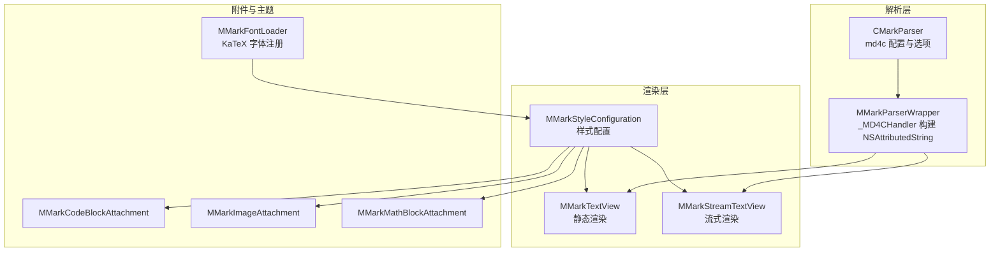
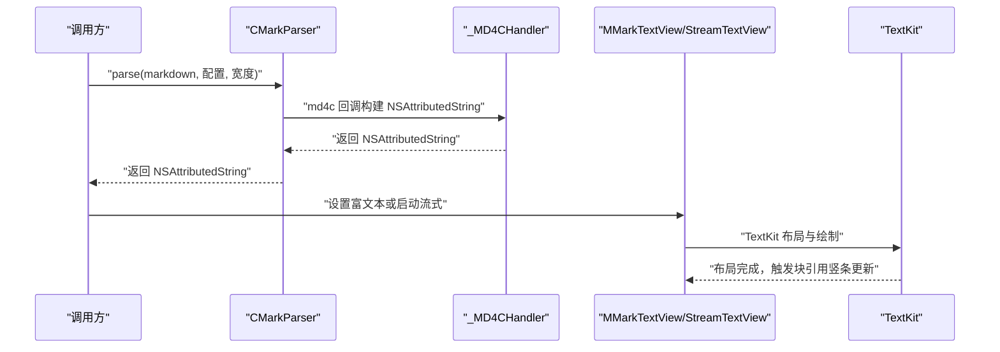
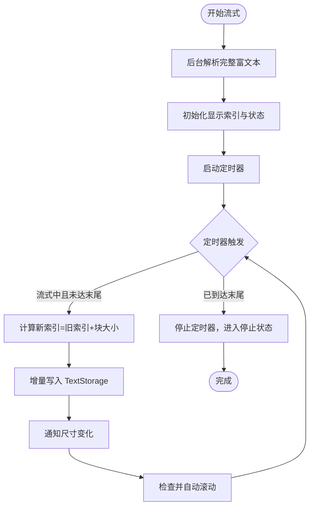
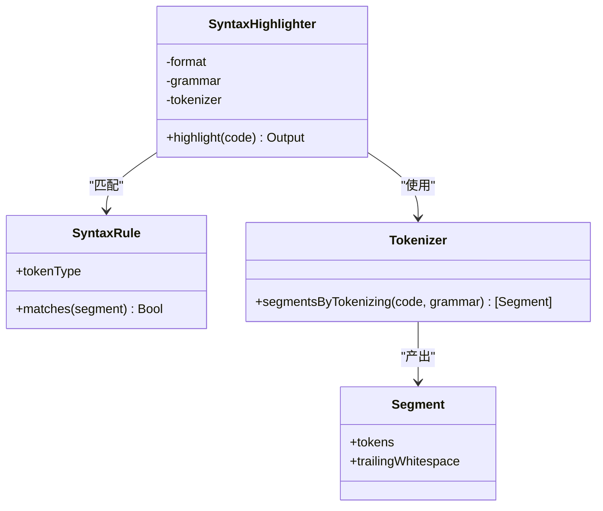
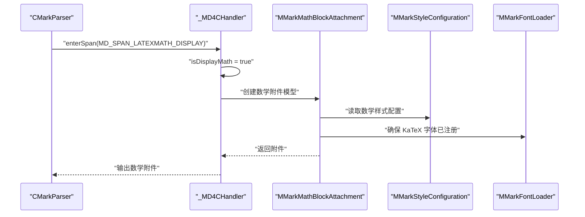
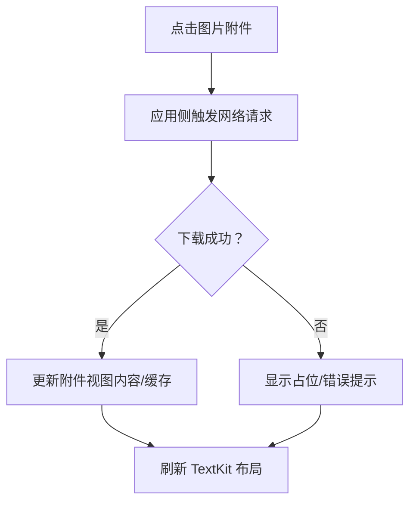
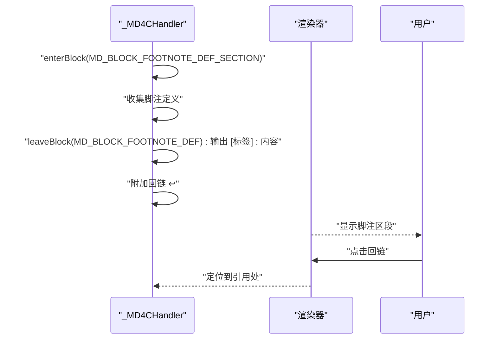
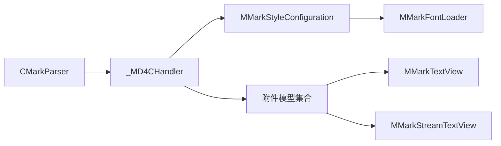

# 高级功能

<cite>
**本文引用的文件**
- [MMarkParser.swift](file://MMarkParser/Sources/MMarkParser.swift)
- [CMarkParser.swift](file://MMarkParser/Sources/Parser/CMarkParser.swift)
- [MMarkParserWrapper.swift](file://MMarkParser/Sources/Parser/MMarkParserWrapper.swift)
- [MMarkStreamTextView.swift](file://MMarkParser/Sources/Renderer/MMarkStreamTextView.swift)
- [MMarkTextView.swift](file://MMarkParser/Sources/Renderer/MMarkTextView.swift)
- [MMarkStyleConfiguration.swift](file://MMarkParser/Sources/Renderer/MMarkStyleConfiguration.swift)
- [MMarkFontLoader.swift](file://MMarkParser/Sources/Renderer/MMarkFontLoader.swift)
- [MMarkCodeBlockAttachment.swift](file://MMarkParser/Sources/Renderer/Attachments/MMarkCodeBlockAttachment/MMarkCodeBlockAttachment.swift)
- [MMarkMathBlockAttachment.swift](file://MMarkParser/Sources/Renderer/Attachments/MMarkMathBlockAttachment/MMarkMathBlockAttachment.swift)
- [MMarkImageAttachment.swift](file://MMarkParser/Sources/Renderer/Attachments/MMarkImageAttachment/MMarkImageAttachment.swift)
- [SyntaxHighlighter.swift](file://MMarkParser/Sources/Splash/Syntax/SyntaxHighlighter.swift)
- [SyntaxRule.swift](file://MMarkParser/Sources/Splash/Syntax/SyntaxRule.swift)
- [StreamViewController.swift](file://cocoapod_demo/cocoapod_demo/StreamViewController.swift)
- [ViewController.swift](file://cocoapod_demo/cocoapod_demo/ViewController.swift)
</cite>

## 目录
1. [简介](#简介)
2. [项目结构](#项目结构)
3. [核心组件](#核心组件)
4. [架构总览](#架构总览)
5. [详细组件分析](#详细组件分析)
6. [依赖关系分析](#依赖关系分析)
7. [性能考量](#性能考量)
8. [故障排查指南](#故障排查指南)
9. [结论](#结论)
10. [附录](#附录)

## 简介
本章节面向希望深度使用 MMarkParser 高级能力的开发者，系统讲解以下主题：
- 流式渲染：如何以“打字机”效果实时渲染 Markdown，支持动态追加与暂停/恢复/停止。
- 语法高亮：语言检测与高亮规则，以及与代码块渲染的协同。
- LaTeX 数学公式：行内与块级公式的识别、渲染与字体加载。
- 远程图片：图片附件模型与尺寸约束，以及与网络加载的关系说明。
- 脚注：引用标记与定义区段的生成与导航。
- 高级配置与性能调优：样式配置项、字体注册、渲染参数与性能建议。
- 复杂使用场景与最佳实践：结合示例控制器演示流式渲染与样式定制。

## 项目结构
MMarkParser 采用“解析器 + 渲染器 + 附件视图 + 主题样式”的分层设计。解析层基于 md4c 的 SAX 回调，构建 NSAttributedString；渲染层通过 TextKit 2/1 将富文本与自定义附件（代码块、图片、水平线、表格、数学公式、脚注）组合显示；样式层提供默认与可定制的主题配置。

**图表来源**
- [CMarkParser.swift:1-81](file://MMarkParser/Sources/Parser/CMarkParser.swift#L1-L81)
- [MMarkParserWrapper.swift:1-800](file://MMarkParser/Sources/Parser/MMarkParserWrapper.swift#L1-L800)
- [MMarkTextView.swift:1-81](file://MMarkParser/Sources/Renderer/MMarkTextView.swift#L1-L81)
- [MMarkStreamTextView.swift:1-398](file://MMarkParser/Sources/Renderer/MMarkStreamTextView.swift#L1-L398)
- [MMarkStyleConfiguration.swift:1-339](file://MMarkParser/Sources/Renderer/MMarkStyleConfiguration.swift#L1-L339)
- [MMarkCodeBlockAttachment.swift:1-22](file://MMarkParser/Sources/Renderer/Attachments/MMarkCodeBlockAttachment/MMarkCodeBlockAttachment.swift#L1-L22)
- [MMarkImageAttachment.swift:1-23](file://MMarkParser/Sources/Renderer/Attachments/MMarkImageAttachment/MMarkImageAttachment.swift#L1-L23)
- [MMarkMathBlockAttachment.swift:1-23](file://MMarkParser/Sources/Renderer/Attachments/MMarkMathBlockAttachment/MMarkMathBlockAttachment.swift#L1-L23)
- [MMarkFontLoader.swift:1-113](file://MMarkParser/Sources/Renderer/MMarkFontLoader.swift#L1-L113)

**章节来源**
- [MMarkParser.swift:1-42](file://MMarkParser/Sources/MMarkParser.swift#L1-L42)
- [CMarkParser.swift:1-81](file://MMarkParser/Sources/Parser/CMarkParser.swift#L1-L81)
- [MMarkParserWrapper.swift:1-800](file://MMarkParser/Sources/Parser/MMarkParserWrapper.swift#L1-L800)
- [MMarkTextView.swift:1-81](file://MMarkParser/Sources/Renderer/MMarkTextView.swift#L1-L81)
- [MMarkStreamTextView.swift:1-398](file://MMarkParser/Sources/Renderer/MMarkStreamTextView.swift#L1-L398)
- [MMarkStyleConfiguration.swift:1-339](file://MMarkParser/Sources/Renderer/MMarkStyleConfiguration.swift#L1-L339)
- [MMarkFontLoader.swift:1-113](file://MMarkParser/Sources/Renderer/MMarkFontLoader.swift#L1-L113)

## 核心组件
- 解析入口与便捷扩展
  - 公共入口提供静态方法与字符串扩展，统一调用底层解析器。
  - 支持容器宽度与样式配置传入，确保渲染一致性。
- 解析器与选项
  - CMarkParser 封装 md4c 选项，启用表格、删除线、任务列表、自动链接、LaTeX 数学、脚注等扩展。
- 渲染器
  - MMarkTextView：一次性渲染 Markdown，支持块引用竖条更新与链接回调。
  - MMarkStreamTextView：增量渲染，定时器驱动，支持暂停/恢复/停止与自动滚动。
- 样式配置
  - 提供标题、段落、代码、链接、引用块、表格、任务列表、有序/无序列表、数学公式、脚注等完整样式项。
- 附件与主题
  - 代码块、图片、数学公式、水平线、表格等附件通过自定义附件视图渲染。
  - KaTeX 字体注册器负责在运行时加载所需字体资源。

**章节来源**
- [MMarkParser.swift:18-41](file://MMarkParser/Sources/MMarkParser.swift#L18-L41)
- [CMarkParser.swift:14-47](file://MMarkParser/Sources/Parser/CMarkParser.swift#L14-L47)
- [MMarkTextView.swift:39-61](file://MMarkParser/Sources/Renderer/MMarkTextView.swift#L39-L61)
- [MMarkStreamTextView.swift:174-300](file://MMarkParser/Sources/Renderer/MMarkStreamTextView.swift#L174-L300)
- [MMarkStyleConfiguration.swift:109-339](file://MMarkParser/Sources/Renderer/MMarkStyleConfiguration.swift#L109-L339)
- [MMarkCodeBlockAttachment.swift:15-21](file://MMarkParser/Sources/Renderer/Attachments/MMarkCodeBlockAttachment/MMarkCodeBlockAttachment.swift#L15-L21)
- [MMarkImageAttachment.swift:17-21](file://MMarkParser/Sources/Renderer/Attachments/MMarkImageAttachment/MMarkImageAttachment.swift#L17-L21)
- [MMarkMathBlockAttachment.swift:16-21](file://MMarkParser/Sources/Renderer/Attachments/MMarkMathBlockAttachment/MMarkMathBlockAttachment.swift#L16-L21)
- [MMarkFontLoader.swift:24-51](file://MMarkParser/Sources/Renderer/MMarkFontLoader.swift#L24-L51)

## 架构总览
下图展示从输入 Markdown 到最终渲染的关键路径，包括解析、样式应用、附件插入与 TextKit 布局。

**图表来源**
- [CMarkParser.swift:55-66](file://MMarkParser/Sources/Parser/CMarkParser.swift#L55-L66)
- [MMarkParserWrapper.swift:134-644](file://MMarkParser/Sources/Parser/MMarkParserWrapper.swift#L134-L644)
- [MMarkTextView.swift:40-49](file://MMarkParser/Sources/Renderer/MMarkTextView.swift#L40-L49)
- [MMarkStreamTextView.swift:174-201](file://MMarkParser/Sources/Renderer/MMarkStreamTextView.swift#L174-L201)

## 详细组件分析

### 流式渲染（MMarkStreamTextView）
- 实现原理
  - 后台解析：在独立队列解析完整富文本，避免阻塞主线程。
  - 定时器推进：以固定时间间隔推进显示索引，按“块大小”增量写入 TextStorage。
  - 动态内容更新：支持追加新片段，重新解析并增量刷新。
  - 状态机：空闲/流式/暂停/停止，委托回调通知尺寸变化与完成事件。
  - 自动滚动：当用户位于底部时，新内容到达自动跟随。
- 关键参数
  - 打字速度（typingSpeed）、块大小（chunkSize）、样式配置（styleConfiguration）、自动滚动（autoScrollToBottom）。
- 性能优化
  - 长文档动态增大块大小，保持视觉流畅。
  - TextKit 2 路径优先，必要时回退至 TextKit 1。
  - 仅在主线程访问共享状态，避免竞态。
- 使用场景
  - 实时日志/聊天消息流式渲染。
  - 大文档预览与渐进加载。
  - 编辑器预览联动。

**图表来源**
- [MMarkStreamTextView.swift:304-351](file://MMarkParser/Sources/Renderer/MMarkStreamTextView.swift#L304-L351)
- [MMarkStreamTextView.swift:174-201](file://MMarkParser/Sources/Renderer/MMarkStreamTextView.swift#L174-L201)
- [MMarkStreamTextView.swift:203-243](file://MMarkParser/Sources/Renderer/MMarkStreamTextView.swift#L203-L243)

**章节来源**
- [MMarkStreamTextView.swift:1-398](file://MMarkParser/Sources/Renderer/MMarkStreamTextView.swift#L1-L398)

### 语法高亮（语言检测与规则）
- 语言检测
  - 代码块语言由 md4c 回调提供，解析器保存语言标识并在代码块模型中传递。
- 高亮规则
  - 使用 Splash 语法高亮框架，通过词法分段与语法规则匹配，输出带样式的富文本。
  - 语法规则定义 Token 类型，Highlighter 将连续相同类型的 token 合并，减少构建成本。
- 与渲染的协同
  - 代码块附件持有模型，模型中包含高亮后的文本与尺寸信息，附件视图据此布局与绘制。
- 性能建议
  - 复用 Highlighter 实例，避免重复初始化。
  - 对大文本分段高亮，控制 Token 区间长度。

**图表来源**
- [SyntaxHighlighter.swift:15-75](file://MMarkParser/Sources/Splash/Syntax/SyntaxHighlighter.swift#L15-L75)
- [SyntaxRule.swift:14-22](file://MMarkParser/Sources/Splash/Syntax/SyntaxRule.swift#L14-L22)

**章节来源**
- [MMarkParserWrapper.swift:369-377](file://MMarkParser/Sources/Parser/MMarkParserWrapper.swift#L369-L377)
- [MMarkCodeBlockAttachment.swift:15-21](file://MMarkParser/Sources/Renderer/Attachments/MMarkCodeBlockAttachment/MMarkCodeBlockAttachment.swift#L15-L21)
- [SyntaxHighlighter.swift:1-92](file://MMarkParser/Sources/Splash/Syntax/SyntaxHighlighter.swift#L1-L92)
- [SyntaxRule.swift:1-23](file://MMarkParser/Sources/Splash/Syntax/SyntaxRule.swift#L1-L23)

### LaTeX 数学公式（行内与块级）
- 识别与选项
  - 通过解析选项启用 LaTeX 数学（行内 $...$ 与块级 $$...$$）。
- 渲染流程
  - 回调阶段区分行内/块级数学，记录状态并在需要时构造数学附件。
  - 数学附件持有模型与 LaTeX 文本，布局时根据可用宽度与字体计算尺寸。
- 字体加载
  - 默认样式优先使用 KaTeX 字体；字体加载器负责从资源包注册字体，确保渲染一致性。
- 样式配置
  - 行内与块级数学分别有独立的字体、颜色与背景配置项。

**图表来源**
- [CMarkParser.swift:36-37](file://MMarkParser/Sources/Parser/CMarkParser.swift#L36-L37)
- [MMarkParserWrapper.swift:756-758](file://MMarkParser/Sources/Parser/MMarkParserWrapper.swift#L756-L758)
- [MMarkMathBlockAttachment.swift:7-12](file://MMarkParser/Sources/Renderer/Attachments/MMarkMathBlockAttachment/MMarkMathBlockAttachment.swift#L7-L12)
- [MMarkStyleConfiguration.swift:131-140](file://MMarkParser/Sources/Renderer/MMarkStyleConfiguration.swift#L131-L140)
- [MMarkFontLoader.swift:24-51](file://MMarkParser/Sources/Renderer/MMarkFontLoader.swift#L24-L51)

**章节来源**
- [CMarkParser.swift:36-46](file://MMarkParser/Sources/Parser/CMarkParser.swift#L36-L46)
- [MMarkParserWrapper.swift:756-758](file://MMarkParser/Sources/Parser/MMarkParserWrapper.swift#L756-L758)
- [MMarkStyleConfiguration.swift:131-140](file://MMarkParser/Sources/Renderer/MMarkStyleConfiguration.swift#L131-L140)
- [MMarkFontLoader.swift:24-51](file://MMarkParser/Sources/Renderer/MMarkFontLoader.swift#L24-L51)

### 远程图片（加载与缓存策略）
- 附件模型
  - 图片附件持有 URL 与 alt 文本，并根据容器宽度计算尺寸，保证在列表/引用块中的正确布局。
- 加载与缓存
  - 本仓库未直接集成第三方网络库（如 Kingfisher）。图片渲染通过附件视图呈现占位与尺寸，实际网络加载与缓存需在应用侧自行实现。
  - 建议在应用层将网络图片下载结果注入到附件视图或替换附件内容，以实现缓存与重用。
- 错误处理
  - 若网络失败，可降级显示占位色或错误提示；在附件视图层统一处理显示异常。

**图表来源**
- [MMarkImageAttachment.swift:7-12](file://MMarkParser/Sources/Renderer/Attachments/MMarkImageAttachment/MMarkImageAttachment.swift#L7-L12)
- [MMarkStyleConfiguration.swift:121](file://MMarkParser/Sources/Renderer/MMarkStyleConfiguration.swift#L121)

**章节来源**
- [MMarkImageAttachment.swift:1-23](file://MMarkParser/Sources/Renderer/Attachments/MMarkImageAttachment/MMarkImageAttachment.swift#L1-L23)
- [MMarkStyleConfiguration.swift:121](file://MMarkParser/Sources/Renderer/MMarkStyleConfiguration.swift#L121)

### 脚注（引用与定义管理）
- 引用标记
  - 回调阶段识别脚注引用，将引用标签作为属性写入富文本，并构造可点击链接。
- 定义区段
  - 收集脚注定义，必要时插入标题与分隔线；每个定义输出“[标签]: 内容”，并附加回链（↩）以便导航。
- 导航
  - 回链使用特定 URL scheme，渲染器可拦截链接点击，跳转到对应位置。

**图表来源**
- [MMarkParserWrapper.swift:433-479](file://MMarkParser/Sources/Parser/MMarkParserWrapper.swift#L433-L479)
- [MMarkParserWrapper.swift:534-547](file://MMarkParser/Sources/Parser/MMarkParserWrapper.swift#L534-L547)

**章节来源**
- [MMarkParserWrapper.swift:433-479](file://MMarkParser/Sources/Parser/MMarkParserWrapper.swift#L433-L479)
- [MMarkParserWrapper.swift:534-547](file://MMarkParser/Sources/Parser/MMarkParserWrapper.swift#L534-L547)

### 高级配置与性能调优
- 样式配置要点
  - 标题层级、段落间距、代码/链接/引用块/表格/任务列表/列表标记、数学公式、脚注等均可定制。
  - 数学公式支持指定显示字体（MTFont），默认优先 KaTeX 字体。
- 性能调优
  - 流式渲染：合理设置打字速度与块大小；长文档自动增大块大小以维持流畅。
  - 解析与渲染：在后台队列解析，主线程仅做增量写入与布局回调。
  - 字体：尽早调用字体注册，避免首次渲染卡顿。
  - 附件尺寸：严格约束宽度，避免 TextKit 边界裁剪与重排。

**章节来源**
- [MMarkStyleConfiguration.swift:189-267](file://MMarkParser/Sources/Renderer/MMarkStyleConfiguration.swift#L189-L267)
- [MMarkStreamTextView.swift:340-342](file://MMarkParser/Sources/Renderer/MMarkStreamTextView.swift#L340-L342)
- [MMarkFontLoader.swift:24-51](file://MMarkParser/Sources/Renderer/MMarkFontLoader.swift#L24-L51)

### 复杂使用场景与最佳实践
- 场景一：聊天/日志流式预览
  - 使用 MMarkStreamTextView，设置较小打字速度与适中块大小；开启自动滚动；在委托中处理尺寸变化以保持可视区域。
  - 示例参考：[StreamViewController.swift:167-199](file://cocoapod_demo/cocoapod_demo/StreamViewController.swift#L167-L199)
- 场景二：大文档渐进加载
  - 初始只渲染少量字符，定时器推进；用户滚动到底部时继续追加。
  - 注意：长文档动态增大块大小，避免卡顿。
- 场景三：代码高亮与主题切换
  - 使用 Splash 高亮器对代码块进行高亮；通过样式配置切换主题色与字体。
  - 示例参考：[SyntaxHighlighter.swift:22-30](file://MMarkParser/Sources/Splash/Syntax/SyntaxHighlighter.swift#L22-L30)
- 场景四：数学公式与字体一致性
  - 确保 KaTeX 字体已注册；在样式中配置数学字体与背景色，保证行内与块级一致。
- 场景五：图片占位与网络加载
  - 使用占位色与尺寸约束；在网络回调成功后替换附件内容或缓存图片，避免重复下载。

**章节来源**
- [StreamViewController.swift:1-279](file://cocoapod_demo/cocoapod_demo/StreamViewController.swift#L1-L279)
- [ViewController.swift:1-46](file://cocoapod_demo/cocoapod_demo/ViewController.swift#L1-L46)
- [SyntaxHighlighter.swift:1-92](file://MMarkParser/Sources/Splash/Syntax/SyntaxHighlighter.swift#L1-L92)
- [MMarkFontLoader.swift:24-51](file://MMarkParser/Sources/Renderer/MMarkFontLoader.swift#L24-L51)

## 依赖关系分析
- 组件耦合
  - 解析器与渲染器通过 NSAttributedString 解耦；渲染器仅依赖样式配置与附件模型。
  - 附件模型与视图提供清晰接口，便于替换实现。
- 外部依赖
  - md4c：SAX 回调解析 Markdown。
  - iosMath：LaTeX 数学渲染。
  - Splash：语法高亮。
  - UIKit/TextKit：富文本与附件视图渲染。
- 循环依赖
  - 未发现循环依赖；各层职责清晰。

**图表来源**
- [CMarkParser.swift:1-81](file://MMarkParser/Sources/Parser/CMarkParser.swift#L1-L81)
- [MMarkParserWrapper.swift:1-800](file://MMarkParser/Sources/Parser/MMarkParserWrapper.swift#L1-L800)
- [MMarkStyleConfiguration.swift:1-339](file://MMarkParser/Sources/Renderer/MMarkStyleConfiguration.swift#L1-L339)
- [MMarkFontLoader.swift:1-113](file://MMarkParser/Sources/Renderer/MMarkFontLoader.swift#L1-L113)

**章节来源**
- [CMarkParser.swift:1-81](file://MMarkParser/Sources/Parser/CMarkParser.swift#L1-L81)
- [MMarkParserWrapper.swift:1-800](file://MMarkParser/Sources/Parser/MMarkParserWrapper.swift#L1-L800)
- [MMarkStyleConfiguration.swift:1-339](file://MMarkParser/Sources/Renderer/MMarkStyleConfiguration.swift#L1-L339)
- [MMarkFontLoader.swift:1-113](file://MMarkParser/Sources/Renderer/MMarkFontLoader.swift#L1-L113)

## 性能考量
- 解析与渲染分离：后台解析，主线程仅做增量写入与布局回调。
- 定时器节流：Leeway 与最小间隔保障稳定性。
- 文档长度自适应：长文档自动增大块大小，兼顾吞吐与视觉流畅。
- 字体注册：集中注册，避免首帧卡顿。
- 附件尺寸约束：防止 TextKit 边界裁剪与重排。

[本节为通用指导，无需列出具体文件来源]

## 故障排查指南
- 解析失败
  - 检查输入是否为空；确认 md4c 回调是否正常返回富文本。
  - 参考：[CMarkParser.swift:55-66](file://MMarkParser/Sources/Parser/CMarkParser.swift#L55-L66)
- 数学公式不显示或字体异常
  - 确认 KaTeX 字体已注册；检查样式配置中的数学字体与背景色。
  - 参考：[MMarkFontLoader.swift:24-51](file://MMarkParser/Sources/Renderer/MMarkFontLoader.swift#L24-L51)，[MMarkStyleConfiguration.swift:131-140](file://MMarkParser/Sources/Renderer/MMarkStyleConfiguration.swift#L131-L140)
- 图片不显示或尺寸异常
  - 检查附件模型尺寸计算与容器宽度；确认应用侧网络加载与缓存逻辑。
  - 参考：[MMarkImageAttachment.swift:17-21](file://MMarkParser/Sources/Renderer/Attachments/MMarkImageAttachment/MMarkImageAttachment.swift#L17-L21)
- 脚注无法点击或顺序错乱
  - 检查脚注定义区段与回链 URL；确保渲染器正确处理链接点击。
  - 参考：[MMarkParserWrapper.swift:534-547](file://MMarkParser/Sources/Parser/MMarkParserWrapper.swift#L534-L547)
- 流式渲染卡顿
  - 调整打字速度与块大小；长文档自动增大块大小；避免频繁全量重排。
  - 参考：[MMarkStreamTextView.swift:340-342](file://MMarkParser/Sources/Renderer/MMarkStreamTextView.swift#L340-L342)

**章节来源**
- [CMarkParser.swift:55-66](file://MMarkParser/Sources/Parser/CMarkParser.swift#L55-L66)
- [MMarkFontLoader.swift:24-51](file://MMarkParser/Sources/Renderer/MMarkFontLoader.swift#L24-L51)
- [MMarkStyleConfiguration.swift:131-140](file://MMarkParser/Sources/Renderer/MMarkStyleConfiguration.swift#L131-L140)
- [MMarkImageAttachment.swift:17-21](file://MMarkParser/Sources/Renderer/Attachments/MMarkImageAttachment/MMarkImageAttachment.swift#L17-L21)
- [MMarkParserWrapper.swift:534-547](file://MMarkParser/Sources/Parser/MMarkParserWrapper.swift#L534-L547)
- [MMarkStreamTextView.swift:340-342](file://MMarkParser/Sources/Renderer/MMarkStreamTextView.swift#L340-L342)

## 结论
MMarkParser 通过“解析回调 + 富文本 + 附件视图 + 主题配置”的架构，提供了高性能、可扩展的 Markdown 渲染能力。流式渲染、LaTeX 数学、脚注与语法高亮等高级特性均以模块化方式实现，既满足复杂场景需求，又便于定制与优化。建议在实际工程中结合应用层的网络与缓存策略，进一步完善图片加载体验，并通过合理的样式与渲染参数获得最佳性能与用户体验。

[本节为总结性内容，无需列出具体文件来源]

## 附录
- 快速参考
  - 解析入口：[MMarkParser.swift:18-26](file://MMarkParser/Sources/MMarkParser.swift#L18-L26)
  - 解析选项：[CMarkParser.swift:14-46](file://MMarkParser/Sources/Parser/CMarkParser.swift#L14-L46)
  - 样式配置：[MMarkStyleConfiguration.swift:189-267](file://MMarkParser/Sources/Renderer/MMarkStyleConfiguration.swift#L189-L267)
  - 流式渲染 API：[MMarkStreamTextView.swift:174-287](file://MMarkParser/Sources/Renderer/MMarkStreamTextView.swift#L174-L287)
  - 示例控制器：[StreamViewController.swift:1-279](file://cocoapod_demo/cocoapod_demo/StreamViewController.swift#L1-L279)，[ViewController.swift:1-46](file://cocoapod_demo/cocoapod_demo/ViewController.swift#L1-L46)

[本节为补充信息，无需列出具体文件来源]