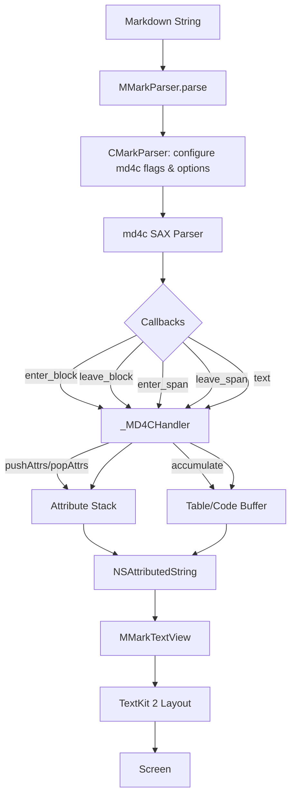

# MMarkParser

A Markdown parsing and rendering library for iOS, built on TextKit 2 with full GFM support.

## Features

- **Standard Markdown** — headings, paragraphs, bold, italic, strikethrough, links, images, code
- **GFM Extensions** — tables, task lists, autolinks, strikethrough
- **LaTeX Math** — inline (`$...$`) and block (`$$...$$`) math rendered via iosMath
- **Syntax Highlighting** — code blocks with language-aware highlighting (Swift + generic)
- **Footnotes** — GFM-style footnote references and definitions
- **Nested Blockquotes** — with customizable bar colors and backgrounds
- **Fully Customizable** — fonts, colors, spacing for every element via `MMarkStyleConfiguration`
- **TextKit 2** — modern layout engine, designed for iOS 15+

## Demo


## Requirements

- iOS 15.0+
- Swift 5.7+
- Xcode 15.0+

## Installation

### CocoaPods

```ruby
pod 'MMarkParser', :git => 'https://github.com/6d616c66/MMarkParser.git', :tag => '1.0.0'
```

MMarkParser depends on:
- [md4c](https://github.com/mity/md4c) — Markdown parsing engine (SAX/callback model)
- [iosMath](https://github.com/kostub/iosMath) — LaTeX math rendering
- [Kingfisher](https://github.com/onevcat/Kingfisher) — remote image loading (for `` images)

## Quick Start

```swift
import MMarkParser

// Parse markdown to NSAttributedString
let markdown = "# Hello\n\nThis is **Markdown** with $E=mc^2$"
let attributedString = MMarkParser.parse(markdown: markdown)

// Or use the String extension
let attributedString = markdown.parseMarkdown()

// Display in MMarkTextView (handles link taps, blockquote bars, etc.)
let textView = MMarkTextView()
textView.setMarkdown(markdown)
view.addSubview(textView)
```

## Customization

```swift
var config = MMarkStyleConfiguration.defaultStyle

// Customize heading fonts
config.headingStyles[1] = .init(
    font: UIFont.systemFont(ofSize: 32, weight: .bold),
    textColor: .label
)

// Customize code blocks
config.codeBlockStyle = .init(
    font: UIFont.monospacedSystemFont(ofSize: 14, weight: .regular),
    textColor: .white,
    backgroundColor: .darkGray
)

// Customize blockquote appearance
config.blockquoteBorderColor = .systemBlue
config.blockquoteBorderWidth = 4
config.blockquoteBackgroundColor = UIColor.systemBlue.withAlphaComponent(0.05)

let result = MMarkParser.parse(markdown: markdown, configuration: config)
```

See `MMarkStyleConfiguration.swift` for all available options.

## Supported Markdown

| Element | Support |
|---|---|
| Headings (H1-H6) | Full |
| Bold, Italic | Full |
| Strikethrough | GFM |
| Inline Code | Full |
| Code Blocks (fenced) | Full + syntax highlighting |
| Links | Full + delegate |
| Images | Full (remote via Kingfisher) |
| Blockquotes | Full + nesting |
| Ordered Lists | Full |
| Unordered Lists | Full |
| Task Lists | GFM |
| Tables | GFM |
| Horizontal Rules | Full |
| LaTeX Math | `$...$` inline, `$$...$$` block |
| Footnotes | GFM |
| Autolinks | URL, email, www |

## Architecture

```
┌─────────────────────────────────────────────────────────────┐
│                       Public API                            │
│                   MMarkParser.swift                         │
│              parse(markdown:configuration:)                 │
│                  String.parseMarkdown()                     │
└────────────┬──────────────────────────────────┬─────────────┘
             │                                  │
             ▼                                  ▼
┌────────────────────────┐    ┌──────────────────────────────┐
│       Parser           │    │         Renderer             │
├────────────────────────┤    ├──────────────────────────────┤
│ CMarkParser.swift      │    │ MMarkTextView.swift          │
│   Parse options & flags│    │   TextKit 2 display view     │
│   md4c initialization  │    │   Blockquote bar drawing     │
│                        │    │   Link tap handling          │
│ MMarkParserWrapper.swift    │                              │
│   md4c SAX callbacks   │    │ MMarkStreamTextView.swift    │
│   enter_block/leave_   │    │   Streaming text support     │
│     block/enter_span/  │    │                              │
│     leave_span/text    │    │ MMarkStyleConfiguration.swift│
│   Attribute stacking   │    │   Full style definitions     │
│   Table accumulation   │    │                              │
│   Footnote processing  │    │ MMarkFontLoader.swift        │
│                        │    │   KaTeX font registration    │
│                        │    │                              │
│                        │    │ MMarkTextCommon.swift        │
│                        │    │   Shared types & helpers     │
└────────────┬───────────┘    └──────────────┬───────────────┘
             │                               │
             │  NSAttributedString            │
             │  with custom attributes        │
             │  & NSTextAttachments           │
             │                               │
             ▼                               ▼
┌─────────────────────────────────────────────────────────────┐
│                     Attachments                             │
├─────────────────────────────────────────────────────────────┤
│ MMarkBaseAttachment/Model     Base classes for all views    │
│ MMarkCodeBlockAttachment      Syntax-highlighted code       │
│ MMarkImageAttachment          Remote images (Kingfisher)    │
│ MMarkTableAttachment          GFM table rendering           │
│ MMarkMathBlockAttachment      LaTeX math (iosMath)          │
│ MMarkHorizontalRuleAttachment Horizontal rule separator     │
│ MMarkListMarkerAttachment     List bullet/number markers    │
└─────────────────────────────────────────────────────────────┘
```

### Data Flow



### Module Overview

```
MMarkParser/
├── Sources/
│   ├── MMarkParser.swift                    # Public API entry point
│   ├── Parser/
│   │   ├── CMarkParser.swift                # Parser configuration & md4c options
│   │   └── MMarkParserWrapper.swift         # md4c SAX callback handler (~1100 lines)
│   ├── Renderer/
│   │   ├── MMarkTextView.swift              # TextKit 2 text view with blockquote bars
│   │   ├── MMarkStreamTextView.swift        # Streaming markdown text view
│   │   ├── MMarkStyleConfiguration.swift    # Style definitions for all elements
│   │   ├── MMarkFontLoader.swift            # KaTeX font registration
│   │   ├── MMarkTextCommon.swift            # Shared types, constants, helpers
│   │   └── Attachments/
│   │       ├── MMarkBaseAttachment/         # Base attachment & model classes
│   │       ├── MMarkCodeBlockAttachment/    # Code block (model + view + provider)
│   │       ├── MMarkImageAttachment/        # Remote image (Kingfisher integration)
│   │       ├── MMarkTableAttachment/        # GFM table (model + view + provider)
│   │       ├── MMarkMathBlockAttachment/    # LaTeX math block (iosMath integration)
│   │       ├── MMarkHorizontalRuleAttachment/ # Horizontal rule separator
│   │       └── MMarkListMarkerAttachment/   # List bullet/number rendering
│   └── Splash/                              # Syntax highlighting (bundled)
│       ├── Grammar/                         # Language grammars (Swift + generic)
│       ├── Tokenizing/                      # Lexer & token types
│       ├── Syntax/                          # Highlighter engine
│       ├── Output/                          # AttributedString output formatter
│       └── Theming/                         # Color & font themes
└── Resources/                               # KaTeX font files (.ttf)
```

### Key Design Decisions

- **md4c SAX model**: Uses callback-driven parsing (`enter_block`/`leave_block`/`enter_span`/`leave_span`/`text`) instead of AST tree traversal. Incrementally builds `NSAttributedString` during the parse walk.
- **Attribute stacking**: An attribute stack (`pushAttrs`/`popAttrs`) tracks style context through nested block/inline structures, ensuring correct attribute propagation (e.g., blockquote attributes carry into bold/italic/link children).
- **TextKit 2 attachments**: Complex elements (code blocks, tables, math, images, horizontal rules, list markers) are rendered as `NSTextAttachment` subclasses with corresponding `NSTextAttachmentViewProvider` classes for lazy view creation.
- **Blockquote bars**: Drawn via Core Graphics `draw(_:)` override in `MMarkTextView`, using `enumerateTextLayoutFragments` (TextKit 2 API) to determine fragment positions — avoids subview management issues.

## Referenced

MMarkParser referenced the implementations of the following two libraries:
- [MarkdownDisplayView](https://github.com/zjc19891106/MarkdownDisplayView)
- [FluidMarkdown](https://github.com/antgroup/FluidMarkdown)

## License

MMarkParser is available under the MIT license. See the [LICENSE](LICENSE) file for more info.

## Acknowledgments

- [md4c](https://github.com/mity/md4c) — C Markdown parser
- [iosMath](https://github.com/kostub/iosMath) — LaTeX math rendering
- [Kingfisher](https://github.com/onevcat/Kingfisher) — Image downloading
- [Splash](https://github.com/JohnSundell/Splash) — Swift syntax highlighting
